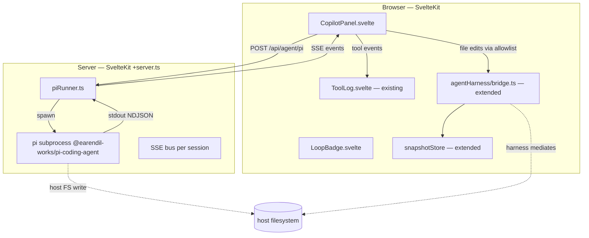

# Design: app-builder CLI co-pilot (pi in the chat pane)

**Status:** Design complete (handoff to Architect)
**Parent:** TRL-156 (proposal) · **Design issue:** TRL-157
**Mock:** _not yet drafted_ — propose the existing AgentRail mockup evolve rather than new mockup until spec is accepted
**Source:** greenfield wedge · globals: `src/app.css`

---

## Overview

App-builder already has a **visual agent chat pane** — `AgentRail` (TRL-152) — driven by an in-browser `agentHarness/` loop that hot-writes guest Svelte components through a `bridge.ts` allowlist. Today the only "agent" available is the harness itself: there is no way to run an external CLI coding agent (Anthropic's **pi**, OpenCode, Claude Code, etc.) inside the same pane and see its tool calls, edits, and stream alongside the visual harness.

This wedge adds a **CLI co-pilot panel** to the existing AgentRail surface. It spawns a `@earendil-works/pi-coding-agent` subprocess on the host's Node (not the WebContainer), pipes its NDJSON event stream to the pane, and **routes every pi file edit through the existing `agentHarness/bridge.ts` allowlist + snapshot ring buffer**. The visual harness and the CLI become two **loops sharing one kernel**: same tool surface, same rollback, same plan, same chat history.

**Posture:** Two agents, one rail. The visual harness stays primary for guest UI work (it knows the manifest, the allowlist, the snapshot ring); pi becomes a peer that can be invoked for the long tail of CLI-shaped work (repo-wide refactor, schema migration, scripted multi-file edits, anything where typing into a REPL beats dragging a card). The pane surfaces both as the same chat stream with a loop-origin badge.

**Emotional tone:** Workshop bench, second monitor now lit. The harness is the lathe; pi is the chopsaw next to it. Both sit on the same bench, share the same tool wall, leave the same sawdust trail.

**Non-goals (v1):** OpenCode support (Bun-native binary — see ADR §6.3); cloud relay (Trellis Cloud proxy — defer to TRL-160 family); per-user billing / cost ceiling; WebContainer-internal pi (deferred — see ADR §6.4); MCP server mode; voice input.

---

## Why this, why now

1. **Visual harness is opinionated.** It edits `src/lib/components/*.svelte` through an allowlist, snapshots to a ring buffer, and rolls back on bad edits. That opinionation is the _value_ — but it also excludes the 60% of agent work that is "edit a config file, run a script, check the build, fix the import, repeat." A CLI peer covers the gap without diluting the visual harness.

2. **The bridge is the contract.** `src/lib/agentHarness/bridge.ts` already mediates all agent → sandbox writes via `pathAllowlist`. If pi writes go through the same bridge, the user gets the same allowlist guarantees, the same snapshot rollback, the same ToolLog entries, the same rollback button. Zero new trust boundary.

3. **Pi is the right first partner.** Pure Node, no native deps, `@anthropic-ai/sdk` with `dangerouslyAllowBrowser: true` works but we run server-side. NDJSON event stream is well-documented. Smaller surface than Claude Code (no TUI) and OpenCode (no native binary). If the integration works for pi, the next agent is a one-day add.

4. **Iroh + Trellis sync comes free later.** Once co-pilot sessions are entities, they can sync between machines via the existing Iroh layer — same pattern as agent harness session continuity.

---

## Surface

### What the user sees

```
┌─────────────────────────────────────────────────────────────┐
│  AgentRail (existing — TRL-152)                             │
│  ┌───────────────────────────────────────────────────────┐  │
│  │  [harness] Remix the card to use a tooltip           │  │
│  │   └ tool: edit_component   ok 14ms                   │  │
│  │   └ tool: snapshot rollback  v12                      │  │
│  │                                                       │  │
│  │  [pi]      Refactor every Button.svelte to variant   │  │
│  │   └ tool: read_file         src/lib/Button.svelte     │  │
│  │   └ tool: write_file (allow) src/lib/Button.svelte    │  │
│  │   └ tool: run_command       pnpm check → ✓            │  │
│  │   └ [stream] Done. Touched 7 files.                   │  │
│  │                                                       │  │
│  │  ╭────────────────────────────────────────────────╮   │  │
│  │  │ > Type a prompt…                                │   │  │
│  │  │                          [harness ▾] [pi] Send  │   │  │
│  │  ╰────────────────────────────────────────────────╯   │  │
│  └───────────────────────────────────────────────────────┘  │
└─────────────────────────────────────────────────────────────┘
```

- Existing `AgentRail` is split into a `CopilotPanel` (chat history + composer) that hosts two **loop handlers**: `harness` (existing) and `pi` (new). Default to the most recently used loop; user can pin.
- Each message gets a **loop-origin badge** (`harness` mono badge, `pi` mono badge with the copilot-stream accent). The user can always tell which loop is talking.
- `pi` tool calls render in the same `ToolLog` component used by the visual harness — same look, same deny/allow coloring, same rollback affordance. **Zero new chrome for the tool surface.**

### What changes in the existing app

| File                                                   | Change                                                                                                                                           | Risk                                                      |
| ------------------------------------------------------ | ------------------------------------------------------------------------------------------------------------------------------------------------ | --------------------------------------------------------- | --- |
| `src/lib/agentHarness/bridge.ts`                       | Add `bridgeFromPi(input)` adapter that maps pi `write_file` events to existing `edit_component` allowlist path                                   | Low — additive                                            |
| `src/lib/agentHarness/snapshotStore.ts`                | Add `tag: 'pi'` on entries that came from pi (preserves existing ring buffer; adds provenance)                                                   | Low                                                       |
| `src/lib/agentHarness/allowlist.ts`                    | Add `pathAllowlist.piEditRoots[]` config (defaults to `['src/lib', 'src/routes', 'package.json']` — wider than harness but still project-scoped) | Med — review defaults                                     |
| `src/lib/components/AgentRail.svelte`                  | Refactor: extract `CopilotPanel.svelte` (chat), keep `ToolLog.svelte` shared                                                                     | Low                                                       |
| `src/lib/components/copilot/CopilotPanel.svelte` (new) | Owns message list + composer; routes to either loop                                                                                              | —                                                         |
| `src/lib/components/copilot/LoopBadge.svelte` (new)    | Renders the harness/pi origin badge                                                                                                              | —                                                         |
| `server/routes/api/agent/pi/+server.ts` (new)          | POST → spawn pi; NDJSON SSE back to pane                                                                                                         | —                                                         |
| `server/agent/piRunner.ts` (new)                       | Subprocess lifecycle (spawn, kill, backpressure, error surfacing)                                                                                | Med — see ADR §6.1                                        |
| `src/lib/agentHarness/types.ts`                        | Add `LoopKind = 'harness'                                                                                                                        | 'pi'`; widen `AgentMessage`to carry`loop`and`piSessionId` | Low |

### What does NOT change

- `WebContainer` boot, snapshot, or teardown — pi never touches WC FS directly
- `pathAllowlist` semantics — the allowlist stays the gate
- The existing `HarnessStatus` component
- The existing `agent.manifest.json` in guest apps — pi is host-side, not guest-side

---

## Architecture



**Key contracts:**

1. **Server is the only thing that spawns pi.** Browser never `fetch`es Anthropic directly — keeps the API key story simple (one env var on the server, never touches the client). See ADR §6.2.

2. **Pi is treated as an untrusted subprocess.** All file writes that pi issues on the host FS are **re-routed through the `bridge.ts` allowlist** before they touch disk. The allowlist becomes the trust boundary for _both_ loops. If pi tries to edit a file outside `piEditRoots`, the bridge denies it, surfaces a `deny` entry in ToolLog, and the write never happens.

3. **NDJSON is the wire format.** Pi's CLI emits one NDJSON object per event (`{type: 'message' | 'tool_use' | 'tool_result' | 'error' | 'done', ...}`). The runner forwards each as an SSE `data:` line. The pane parses and renders. This is the same pattern as Vercel AI SDK UI Message Stream — no new transport to invent.

4. **Sessions are entities in the host's local store.** A `pi_session` row in the existing Dexie `app-builder-webcontainer` DB (extending v2 → v3) holds: `id`, `loop`, `messages[]`, `createdAt`, `lastEventAt`, `piSessionId` (pi's own resume token), `status`. Resumable across reloads. Syncable later via Iroh.

5. **Backpressure is the unglamorous killer.** A 50-message pi session produces ~500 NDJSON lines. If the pane can't keep up, the subprocess blocks on stdout and pi hangs. See ADR §6.1 for the bounded-channel + client-ack design.

---

## Data flow — a typical pi turn

1. User types into the composer, picks `pi`, hits Send.
2. `CopilotPanel` POSTs to `/api/agent/pi` with `{ sessionId, prompt }`. The runner **resumes** the existing pi subprocess for that session, or spawns a new one.
3. Pi streams events: `message_start` → `text` (chunked) → `tool_use` (read_file) → `tool_result` → `text` → `tool_use` (write_file) → ...
4. For each `write_file` tool_use, the runner **does not** shell out — it forwards the proposed edit to the bridge over the same `/api/agent/bridge` endpoint the visual harness uses. The bridge applies the allowlist, snapshots to the ring buffer, returns `ok | deny`.
5. Pi receives the tool result and continues. A denied write is rendered in pi as `{ok: false, denied: true, reason}` — the same shape the harness returns.
6. When pi emits `done`, the runner closes the SSE stream and persists the final `messages[]` snapshot to Dexie.
7. On the next pane open, `CopilotPanel` hydrates from the Dexie row and offers "Resume" if the pi subprocess is still alive (PID exists in the runner's session map).

---

## Component inventory

| Component                | Status   | Purpose                                              |
| ------------------------ | -------- | ---------------------------------------------------- |
| `CopilotPanel.svelte`    | new      | Top-level chat surface; routes to harness or pi loop |
| `LoopBadge.svelte`       | new      | Origin tag on each message (`harness` / `pi`)        |
| `LoopPicker.svelte`      | new      | Toggle in composer: which loop gets the next prompt  |
| `PiSessionStatus.svelte` | new      | Footer: pid, last event age, "kill" affordance       |
| `ToolLog.svelte`         | existing | Shared — already renders allow/deny                  |
| `HarnessStatus.svelte`   | existing | Shared                                               |
| `AgentRail.svelte`       | refactor | Becomes a thin shell over `CopilotPanel` + `ToolLog` |

---

## API surface (server)

```ts
// POST /api/agent/pi
type StartOrResumeBody =
  | { kind: 'start'; prompt: string; cwd?: string }
  | { kind: 'resume'; sessionId: string; prompt: string }
  | { kind: 'cancel'; sessionId: string }

// Response: SSE stream of NDJSON-wrapped pi events
type PiEvent =
  | { type: 'session_start'; sessionId: string; piSessionId: string }
  | { type: 'message_start'; messageId: string }
  | { type: 'text_delta'; messageId: string; delta: string }
  | { type: 'message_end'; messageId: string }
  | { type: 'tool_use'; id: string; name: string; input: unknown }
  | { type: 'tool_result'; id: string; output: string; denied?: boolean; ok: boolean }
  | { type: 'error'; message: string; recoverable: boolean }
  | { type: 'done'; reason: 'complete' | 'cancelled' | 'error' | 'max_steps' }
```

```ts
// POST /api/agent/bridge (existing, extended)
// Reused by both loops. Body widens to include `loop: 'harness' | 'pi'`
type BridgeBody =
  | { kind: 'edit_component'; path: string; contents: string; loop: 'harness' | 'pi' }
  | { kind: 'read_file'; path: string; loop: 'harness' | 'pi' }
  | { kind: 'run_command'; command: string; cwd?: string; loop: 'pi' } // harness has its own path
  | { kind: 'rollback'; toVersion: number; loop: 'harness' | 'pi' }
```

---

## Failure modes (what we plan for)

| Failure                         | Symptom                                         | Handling                                                                                                       |
| ------------------------------- | ----------------------------------------------- | -------------------------------------------------------------------------------------------------------------- |
| Pi subprocess dies (OOM, crash) | Stream ends mid-turn; pane shows `error` event  | Runner restarts with last `piSessionId`; user sees "reconnected" badge                                         |
| Allowlist denies a pi write     | Pi's tool result is `{ok: false, denied: true}` | Pi self-corrects on next turn OR user sees the deny in ToolLog and intervenes                                  |
| SSE buffer overruns             | Pane lag; pi hangs on stdout write              | Bounded channel (256 events) + client ack every N events; overflow drops oldest with a `backpressure` event    |
| User navigates away mid-session | Pane unmounts; SSE consumer dies                | Runner keeps subprocess alive; session resumable; UI shows "session running" indicator on return               |
| Two panes open the same session | Two SSE consumers race                          | Pin session to one consumer; second pane gets `409 conflict` and falls back to read-only history               |
| API key missing on server       | Pi subprocess exits immediately                 | Runner intercepts exit, emits `error: 'ANTHROPIC_API_KEY not set in server env'`, surfaces as a fixable banner |
| Pi version drift                | Runner expects v0.3 event shape; user has v0.4  | Pin `@earendil-works/pi-coding-agent` in `package.json`; runtime version check on spawn                        |
| Host FS write outside allowlist | Bridge denies; pi gets `denied: true` result    | Trust boundary holds — see ADR §6.2                                                                            |

---

## Acceptance criteria (design level)

1. User can invoke pi from the existing AgentRail without leaving the pane.
2. Pi tool calls appear in the same `ToolLog` with allow/deny semantics identical to the visual harness.
3. Denied pi writes never reach disk; the deny is visible in both ToolLog and the pi turn transcript.
4. Pausing (closing the pane) and resuming (reopening) within the same session keeps the pi subprocess alive and reattaches the SSE stream.
5. Killing the session is one click; the subprocess reaps cleanly (no zombie pid).
6. The visual harness and pi are addressable in the same chat stream without confusion (loop badges).
7. The bridge still refuses edits outside the allowlist; the existing TRL-152 acceptance criteria continue to hold.

---

## Open questions for Architect

1. **Allowlist defaults for `piEditRoots`** — should pi be able to edit `package.json`? `svelte.config.js`? `.env`? My proposal: `['src/lib/**', 'src/routes/**', 'src/app.css', 'package.json']`. Deny `.env*`, `bun.lock`, `pnpm-lock.yaml`, anything outside `src/`. Need a sign-off.
2. **`run_command` scope** — should pi be allowed to run `pnpm check` / `pnpm test`? It's the single most useful thing a CLI agent does, but it also expands the trust surface (a long-running command can be killed, can write to FS, can hit network). Proposal: allow a **fixed command allowlist** (`pnpm check`, `pnpm test`, `pnpm lint`, `pnpm build`) with timeout and stdout capture. Reject everything else.
3. **Pi's own MCP / extension story** — pi can be extended with extra tools. Do we expose that, or ship a locked tool set tied to our bridge? Proposal: locked set in v1, open in v2.
4. **Session model** — one pi subprocess per `AgentRail` instance (simple) vs one per project (better for `switchProject` from TRL-155) vs one per Trellis lane (overkill for v1). Proposal: one per project, killed on project switch with a "session ended" event.
5. **Cost ceiling** — see ADR §6.5.

---

## File touch list (design intent)

**New:**

- `src/lib/components/copilot/CopilotPanel.svelte`
- `src/lib/components/copilot/LoopBadge.svelte`
- `src/lib/components/copilot/LoopPicker.svelte`
- `src/lib/components/copilot/PiSessionStatus.svelte`
- `server/agent/piRunner.ts`
- `server/routes/api/agent/pi/+server.ts`
- `server/routes/api/agent/pi/[sessionId]/+server.ts` (cancel/kill)
- `src/lib/agentHarness/piAdapter.ts` (NDJSON → bridge calls)
- `e2e/copilot-pi.spec.ts`

**Modify:**

- `src/lib/agentHarness/bridge.ts` (add `loop` to body; keep all existing contracts)
- `src/lib/agentHarness/allowlist.ts` (add `piEditRoots` config)
- `src/lib/agentHarness/snapshotStore.ts` (add `tag: 'harness' | 'pi'`)
- `src/lib/agentHarness/types.ts` (add `LoopKind`, widen `AgentMessage`)
- `src/lib/components/AgentRail.svelte` (refactor to host `CopilotPanel`)
- `src/lib/dexie.ts` (schema v3: add `pi_sessions` table)
- `package.json` (add `@earendil-works/pi-coding-agent`, pin version)

**Out of scope (deferred):**

- Trellis Cloud proxy (TRL-160 family)
- OpenCode adapter (Bun-native binary — see ADR §6.3)
- WebContainer-internal pi (deferred — see ADR §6.4)
- Voice input, image input
- Multi-agent orchestration (planner + pi, planner + harness)
- Cross-machine session sync via Iroh
