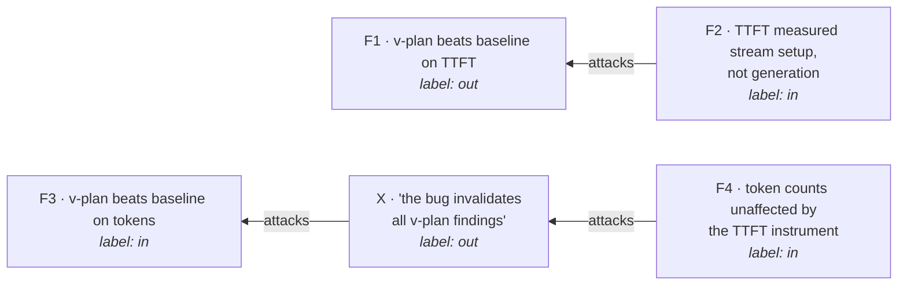

# Finding semantics — what formal argumentation does and does not lend us

**Status:** Design note (no code)
**Companion to:** [app_builder_run_envelope.md](./app_builder_run_envelope.md) · [app_builder_agent_loop_architecture.md](./app_builder_agent_loop_architecture.md)
**Date:** 2026-08-29
**Source:** Rossie, Delobelle, Konieczny, Lens, Vesic — *Collective Satisfaction Semantics for Opinion Based Argumentation*, KR 2024 (pp. 631–641)

The experiment role proposes a verdict enum of `supported | refuted | inconclusive`. That is a three-valued labelling, and three-valued labellings have forty years of formal treatment behind them. This note records what transfers, what does not, and the one cheap change worth making now.

**Bottom line:** the ontology is *not* the thing to borrow yet. The method is.

---

## 1. The direct hit: information loss from collapsing three values into two

The paper's critique of the competing ABSAF framework (p. 1):

> "Notably, **ABSAF lacks neutral votes in its model, leading to information loss** and potentially impacting the final outcome."

And their defense of the three-point scale (p. 4):

> "Beliefs inherently entail binary states of acceptance or rejection… This results in three possible states: the formula is implied, its negation is implied, or **neither is implied**… We believe adding the neutral value (abstaining from voting with 0) is crucial."

They even name the lossy adapter — `Vote2Bal(v) = {x | v(x) = 1}` (Def. 20) — the conversion that folds `{-1, 0}` into "not approved" and thereby makes *disagreement* and *abstention* indistinguishable.

This is the same argument the run envelope already makes in code, one rung lower:

```ts
/**
 * Null for locally hosted models. Deliberately not 0: a synthetic zero gets
 * averaged as though it were a measurement.
 */
costUsd: number | null;
```

`0` is a measurement. `null` is an abstention. Collapsing them is information loss, and it is silent. **Same failure, two layers apart** — worth stating once as a principle rather than rediscovering per field.

---

## 2. `inconclusive` is currently a wastebasket; `undec` is not

In the proposed enum, `inconclusive` is "none of the above." In Dung's labelling (Def. 3) `undec` is *computed*, and precisely characterised:

| label | condition |
|---|---|
| `in` | **every** attacker is `out` |
| `out` | **some** attacker is `in` |
| `undec` | no attacker is `in`, **and** some attacker is not `out` |

So `undec` means "the evidence is in genuine, unresolved conflict" — a positive claim, not residue. That distinction is available cheaply without adopting any of the machinery: **make `inconclusive` carry a reason.**

| reason | meaning | resolved by |
|---|---|---|
| `underpowered` | too few trials to separate arms | more trials |
| `conflicting` | trials genuinely disagree — the true `undec` | a discriminating experiment |
| `invalid-metric` | the measurement itself was wrong | fixing the instrument, then re-running |
| `not-run` | never executed | running it |

These are not stylistic variants. They have different costs and different fixes, and lumping them means the backlog cannot be triaged.

`invalid-metric` already has an occupant: every conclusion derivable from pre-fix TTFT numbers was retracted by a *methodological* discovery rather than a contrary experiment (see run-envelope §5). That is an attack relation appearing in the wild, once — and the most destructive kind, because it invalidates a whole cohort at a stroke rather than one finding at a time.

---

## 3. The warning to heed immediately: unanimity rules are useless here

Section 4.5 reports their skeptical operator failing on the worked example:

> "COS^so yields an empty set as a result. That is because there is no unanimity in the votes… This constitutes a significant limitation of the method, particularly in contexts such as public debates where **achieving unanimity is improbable**."

They promote the fix to an *essential* axiom — **Non-triviality (NT)**: "ensures decisiveness, i.e., the system is always able to arrive at some solution."

For a stochastic agent, unanimity across N trials is about as likely as unanimity in a public debate. **A verdict rule of "all runs agree or it's inconclusive" will report `inconclusive` forever while looking rigorous.** This is the single most actionable thing in the paper for us, and it is a negative result.

---

## 4. Where the analogy breaks

Stated plainly, because getting this wrong costs real information.

**Voters and trials are different kinds of object.** Opinion aggregation combines *preferences* — equal-standing, no ground truth, goal is a fair collective decision. Trials are *samples from a distribution* — there **is** a ground truth (the underlying rate), and disagreement between runs is **noise to be estimated, not preference to be reconciled**.

If 3 of 5 runs succeed, the right output is an interval on `p`, not a fair aggregation of five voters. Social-choice machinery there would discard the statistical structure — precisely what makes a trial a trial.

**Dung's framework takes the attack relation as given.** `att` is an input to an AF. In a findings graph, *"does finding G attack finding F?"* is the entire hard problem, and the paper offers nothing on inferring it.

---

## 5. Two layers. Do not conflate them.

| layer | question | right tool | argumentation applies? |
|---|---|---|---|
| **Within one experiment** — N trials of one arm | "what is this arm's success rate?" | distributions, intervals, medians + spread | **No.** Statistics. The paper contributes only the §3 warning. |
| **Across experiments** — the findings graph | "given everything we've run, what do we currently believe?" | labelling + reinstatement | **Yes.** This is the genuine fit. |

Layer 2 is where findings really do attack each other:



Read the reinstatement: `F3` survives **not** because nothing attacked it, but because its attacker `X` is itself defeated by `F4`. That is the structure you want when a methodology bug lands — it tells you *which* prior findings actually fall and which are reinstated, rather than forcing a blanket retraction.

Definitions 4 and 5 (down-admissible, up-complete) supply the closure algorithm: after folding in a new finding you may hold an incoherent belief set, so you close it to the nearest admissible one.

---

## 6. The thing actually worth stealing now: the axiomatic method

The paper's most portable move is not its ontology — it is Table 2. Ten properties, split **essential** vs **additional**, every method scored against every property. It converts "which aggregation is better?" from a debate into a lookup.

The cheap version: **write the properties down before writing the verdict function.** Three port directly, one is ours.

| property | for a verdict over N runs | why it matters | testable? |
|---|---|---|---|
| **Vote Anonymity** (VA) | verdict is invariant under reordering of runs | if run order changes the verdict, the function is reading noise as signal | yes — permute and assert equality |
| **Monotony** (M) | adding a run that agrees does not flip the verdict | otherwise more evidence can *weaken* a conclusion | yes — property test |
| **Non-triviality** (NT) | always yields a verdict, never "no answer" | the §3 trap | yes — assert over random inputs |
| **Unanimity** (EU) | if every run agrees, that is the verdict | sanity floor | yes |
| **Instrument-scoped** (ours) | a verdict records the `buildId` + metric version it was computed under | so an instrument fix can invalidate exactly the affected cohort, not all of them | yes — field presence |

The last one is not in the paper. It is the generalisation of the TTFT incident, and it is the reason the run envelope stamps `buildId` and hashes the config: **a finding is only as valid as the instrument that produced it, so the finding must name its instrument.**

---

## 7. Recommendation

**Now (cheap, no new machinery):**
1. `inconclusive` gains a reason code — §2's four values.
2. Any verdict function ships with the §6 property tests written first.
3. Findings record the `buildId` and metric version they were computed under.

**Not now:** the findings AF. There are currently two smoke runs and zero findings; a Dung framework over an empty graph is the "machinery before data" error this project has twice declined to make. Revisit when there are roughly twenty findings *that actually conflict* — conflict is the trigger, not count alone.

**Never:** argumentation semantics inside a single experiment. That is statistics, and voting rules would throw away the distributional structure.

---

## 8. Reading notes

Most relevant sections, if returning to the paper:

- **Def. 3** (labellings) — the precise `in`/`out`/`undec` conditions; §2 above.
- **Def. 4–5** (down-admissible, up-complete) — closure of an incoherent belief set.
- **Def. 6–8** (skeptical / credulous / super-credulous) — the design space for aggregating disagreeing sources; §3's failure is Def. 6.
- **§4.5 Observations** — the worked failures, including `COS^so → ∅`.
- **§5 + Table 2** — the axiomatic method; the part worth imitating.
- **p. 4, right column** — the defense of the neutral value; §1 above.
