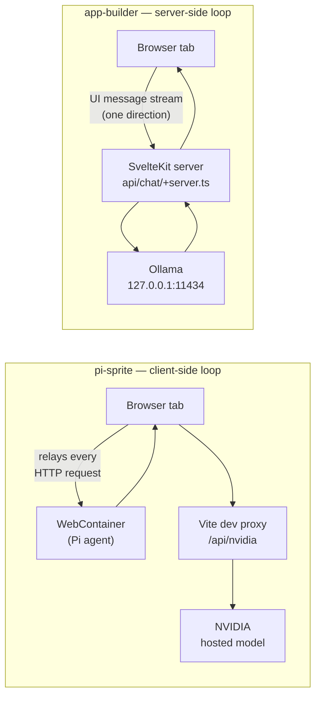
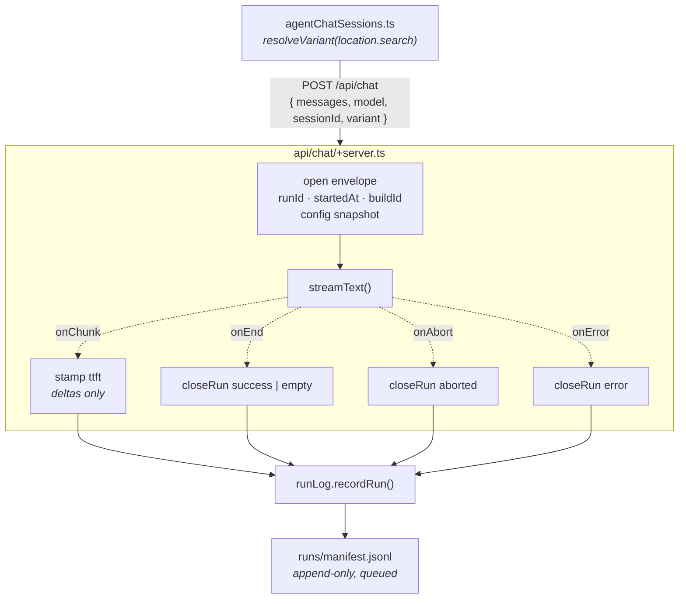
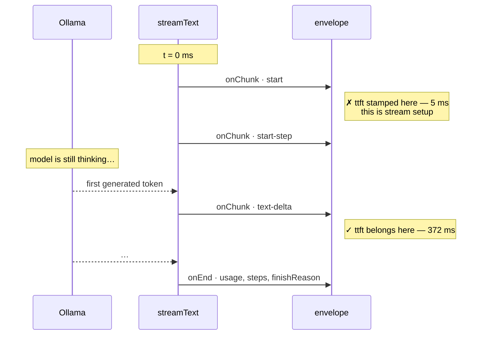

# Run envelope — instrumenting the app-builder agent loop

**Status:** Shipped (first increment)
**Parent:** TRL-150 · agent harness · **Companion to:** [app_builder_agent_loop_architecture.md](./app_builder_agent_loop_architecture.md) (§7 Option B, §10 phase 2)
**Date:** 2026-08-29
**Build verified at:** `4e332b1-dirty`

A run envelope is the header and footer that turn an agent turn into an *experiment datum* — one durable record per turn, carrying the fields you cannot reconstruct afterward.

This document records what was built, **why it landed here rather than in pi-sprite**, and the measurement bug the first real run exposed. The bug is the most instructive part; skip to §5 if you want the punchline.

---

## 1. Why app-builder and not pi-sprite

The work started in `pi-sprite/examples/webcontainer-react`, where a run envelope already ships. The question was whether to keep iterating there or move.

The instinct to move was right. The stated reason was wrong, and the correction is the useful part.

**Stated reason:** "any optimizations to the persistence layer ought to be made in app-builder."
**Actual situation:** app-builder had no persistence layer to optimize.

`src/lib/chat/persistence.ts` was, in full, one localStorage key holding one transcript:

```ts
export const CHAT_STORAGE_KEY = 'app-builder:chat-transcript:v1';
localStorage.setItem(CHAT_STORAGE_KEY, JSON.stringify({ model, messages }));
```

And `agentChatSessions.ts:42` persisted only the *primary* session:

```ts
const persisted = sessionId === primarySessionId ? loadPersistedChat() : null;
```

Every other agent tab started empty and was never saved. So there was nothing to port an optimization *to* — the work was building the layer for the first time.

> **Lesson.** "Move the improvement to the other repo" and "build the thing for the first time in the other repo" are very different jobs. Check which one you are actually proposing before sizing it. Read the target's code, not your memory of it.

---

## 2. The difference that actually decided it: loop topology

The two harnesses run the agent loop in different places, and that determines where instrumentation can physically live.



The consequence is not stylistic:

| | pi-sprite | app-builder |
|---|---|---|
| Browser's role | **is** the HTTP transport — sees every request and response | receives a rendered UI message stream only |
| Where usage/tokens exist | in the browser, because it relays the call | **only on the server** |
| Natural home for the log | client-side, IndexedDB | **server-side** |
| Model | NVIDIA hosted | local Ollama (`gemma4`) |

In pi-sprite the client can compute a run record because it relays the traffic. In app-builder it **cannot**: `streamText()` holds the token counts, and before this change `result.usage` was never read. Tokens, finish reason, and step count were discarded on every single request.

> **Lesson — the reversibility test.** Metrics that can be recomputed later from a stored transcript are cheap to defer. Fields that exist only at the moment of the call — token usage, the build that produced the run, which arm it belonged to — are gone forever if not captured. Spend your effort on the irreversible half.

This is also exactly what the architecture doc already decided. §7 evaluates three placements and recommends **Option B, host-side loop**, on the grounds that it makes "the session log server-authored (natural durability + no key exposure)." This work is the first concrete increment of that decision.

---

## 3. What shipped



| File | Role |
|---|---|
| `src/lib/runEnvelope.ts` | **new** — portable schema. Field names deliberately match pi-sprite's so the harnesses are comparable in *shape*. No fs, no runes: both sides import it. |
| `src/lib/server/runLog.ts` | **new** — append-only writer. Writes are queued, not raced; first failure disables the log with one warning. |
| `src/routes/api/chat/+server.ts` | envelope opened before the model call, closed on all four exit paths. |
| `src/lib/agentChatSessions.ts` | resolves `?variant=` once per page load, sends it in the body. |
| `vite.config.js` + `src/global.d.ts` | `__APP_BUILDER_BUILD_ID__` — git short SHA, `-dirty` when the tree is. |
| `.gitignore` | `runs/` — commit evaluations, never raw runs. |

### Three decisions worth keeping

**The config snapshot is assembled field by field, never spread from the request body.** A field added to the request contract must not silently appear in the run log. The same discipline applies in pi-sprite, where the log is user-exportable.

**The system prompt is stored as length + FNV hash, not verbatim.** The envelope's job is to *discriminate between arms*, not to keep a second copy of the prompt. A changed hash tells you the arm changed; that is all it needs to know.

**`costUsd` and `reasoningTokens` are `null`, not `0`.** Ollama runs locally, so there is no cost — but a synthetic zero gets averaged as though it were a measurement. Null propagates as "unknown"; zero lies quietly.

> **Vindicated later the same day.** The think-mode smoke run showed a `think: true` turn spending **141 output tokens to produce a 10-character answer** while `outputTokenDetails.reasoningTokens` stayed `null` — so reasoning demonstrably occurred and the provider simply does not break it out. Had this field defaulted to `0`, the log would have read *"thinking is free"* on every run, and the experiment would have confidently concluded exactly that. Reasoning cost is instead recovered by subtracting the two arms' `outputTokens`; see [experiment.md → Instrument notes](./experiments/think-mode/experiment.md).

**Variant comes from a URL parameter, not a setting**, so a Playwright driver can run one corpus against two arms without a human touching the UI.

### Handling the read-only filesystem

The app builds with `adapter-vercel`, where the project directory is not writable. Rather than sniff for the environment, the **first failed write disables the log and warns once**. Sniffing goes stale; a failed write does not. In practice the loop only runs locally anyway — the model is on `127.0.0.1`.

---

## 4. Proof it works

`vite build` passes, and `svelte-check` filtered to the touched files is clean. (The repo carries **346 pre-existing type errors across 235 files**, so `svelte-check` is not usable as a gate here — filter it to your diff or it tells you nothing.)

A real turn against `gemma4`, run on a throwaway server so the working dev server was untouched:

```json
{
  "runId": "70c460a3-…", "sessionId": "smoke-1",
  "variant": "v-smokebadchars",
  "buildId": "4e332b1-dirty",
  "config": { "model": "gemma4", "provider": "ollama", "thinking": true,
              "systemPromptChars": 293, "systemPromptHash": "0c040869", "messageCount": 1 },
  "outcome": "success", "finishReason": "stop",
  "metrics": { "durationMs": 16770, "steps": 1, "toolCalls": 0,
               "inputTokens": 82, "outputTokens": 28, "totalTokens": 110,
               "reasoningTokens": null, "costUsd": null }
}
```

`variant` arrived as `"v-smoke!!bad chars"` and was sanitized on both sides. `buildId` matches HEAD. Those token counts are the data that was being thrown away.

---

## 5. The bug: a metric that always worked and was always wrong

> 🎬 **Animated walkthrough:** [`animations/media/videos/ttft_bug/1080p60/TtftBug.mp4`](./animations/media/videos/ttft_bug/1080p60/TtftBug.mp4) (23 s).
> Source: [`animations/ttft_bug.py`](./animations/ttft_bug.py) — see §9 to rebuild.

The first record said **`ttftMs: 5`** on a turn that took **16,770 ms**.

Time-to-first-token was written the obvious way:

```ts
onChunk: () => {
  if (firstChunkAt === null) firstChunkAt = Date.now();
},
```

But `onChunk` fires for every part of the stream, and a stream does not open with generated text. It opens with control parts:



The fix filters to parts that carry generated content:

```ts
onChunk: ({ chunk }) => {
  // `onChunk` also fires for `start` and `start-step` control parts, which
  // arrive as soon as the stream opens — timing those reports 5 ms on a 16 s turn.
  if (chunk.type !== 'text-delta' && chunk.type !== 'reasoning-delta') return;
  // Reasoning counts as generation: with `think: true` the first token the model
  // emits is often reasoning, and that is when waiting actually ends.
  if (firstChunkAt === null) firstChunkAt = Date.now();
},
```

Same route, before and after:

```
v-smokebadchars   ttft =   5 ms   dur = 16770 ms    ← measuring stream setup
v-ttft            ttft = 372 ms   dur =  4688 ms    ← measuring generation
```

> **Lesson — the dangerous bug is the one that never fails.** This metric populated on every run, never threw, never logged a warning, and was plausible enough to put in a table. Had the envelope shipped without a real turn behind it, the first experiment would have concluded that TTFT was constant across arms — a confident, wrong, fully-instrumented answer.
>
> The build passing proved the code *ran*. Only executing one real turn and reading the number proved it was *right*. **Type-checking validates shape; only a real run validates semantics.** For a measurement, "it compiles" is nearly worthless evidence.

The general form: when you instrument a stream, find out what actually flows through it. The callback's name (`onChunk`) implied content; the type union (`TextStreamPart`, 26 members, of which only two are generated deltas) said otherwise.

---

## 6. How this relates to the session event log

The architecture doc has an apparent inconsistency worth naming, because it confused this work:

- **§2 and §10 phase 1** put the durable `SessionEvent[]` log in **Dexie, client-side**.
- **§7** recommends Option B on the grounds that it makes the log **server-authored**.

Both are fine, because they are two different artifacts. Making that explicit:

| | Session event log (§2, planned) | Run manifest (this doc, shipped) |
|---|---|---|
| Granularity | per step, per chunk, per tool call | **one record per turn** |
| Purpose | drives transcript, tool log, undo, model history | experiments — comparing arms |
| Lives in | Dexie, client | `runs/manifest.jsonl`, server |
| Consumer | the UI | offline analysis |
| Volume | thousands of events per session | tens of runs per experiment |

They are complementary. The run manifest is a coarse index *over* turns; the session log is the fine-grained substrate *within* them. Building the manifest first was deliberate — it captures the irreversible fields today without pre-committing the event schema §2 still owns.

### A known limitation §8 already predicted

Defensive rule §8.1 says:

> **Async state is not sync state.** Do NOT treat one `send()` or one `running→idle` transition as one message's result… Define a run's interval explicitly.

The envelope currently defines a run as **one HTTP request to `/api/chat`**. Today that is exactly one turn, because there are no tools and `steps` is always 1. Once the tool pipeline lands (§10 phase 3) and a turn spans multiple model calls, *request ≠ turn*, and the manifest will silently start counting steps as runs.

**This is written down now so it is a scheduled change and not a future mystery.** When phase 3 begins, the run boundary must move from the HTTP request to the turn — which is precisely why `runId` and `sessionId` are already on the record.

---

## 7. Deliberately not built

**A `/runs` projection in the icon rail.** The rail is a clean `RailItem[]` and adding an entry is roughly four lines — but a viewer is a *consumer*, and there are currently two smoke runs to look at. Build the capture, defer the viewer until there is data that makes the viewer worth designing. The same call was made in pi-sprite, where `deriveRuns()` ships with no in-app consumer.

**Actual experiments.** Instrumentation is not evidence. The obvious first hypothesis is sitting in `ollama.ts`:

```ts
return ollama(modelId, { think: true });   // never measured
```

`think: true` is pinned, unmeasured, and now fully instrumented on both latency and tokens — a genuine single-variable delta against a frozen baseline.

---

## 8. Reusable checklist

Distilled from the two mistakes this work actually made:

1. **Read the target's code before sizing a port.** "Move the optimization" and "build it for the first time" look identical from a distance.
2. **Sort the work by reversibility.** Capture what only exists at the moment of the call; defer whatever can be recomputed.
3. **Never let a synthetic zero stand in for an unknown.** Nulls propagate honestly; zeros get averaged.
4. **Run one real turn and read the numbers.** A green build says the code ran, not that the measurement is meaningful.
5. **When instrumenting a stream, enumerate what flows through it.** Callback names describe intent; the type union describes reality.
6. **Write down the limitation you already know about.** A documented future break is a scheduled task; an undocumented one is a bug with a long fuse.

A seventh was learned while *documenting* this, not while building it — see §9.

---

## 9. Rebuilding the animation

The `.mp4` is committed; the 267 MB toolchain that produces it is not.

```bash
uv venv .venv-manim --python 3.12
uv pip install --python .venv-manim manim

.venv-manim/bin/manim -qh \
  --media_dir docs/artifacts/animations/media \
  docs/artifacts/animations/ttft_bug.py TtftBug
```

No LaTeX is installed or required — the scene uses Pango `Text` only, never `Tex`/`MathTex`.

Two environment specifics are pinned in comments in the scene, because both cost a render cycle to find:

- manim 0.21 exposes `LEFT`/`RIGHT`/`UP`/`DOWN` as plain sequences, so `LEFT * 6.2` raises `TypeError: can't multiply sequence by non-int of type 'float'`. Scaled directions use explicit `np.array` vectors.
- The default font is a serif that collapses spaces in Pango — `"on a 16,770 ms turn"` rendered as `"on a16,770 ms turn"`. Faces are named explicitly (`Helvetica`, `Menlo`), both verified via `manimpango.list_fonts()`.

### The seventh lesson, learned here

Midway through, a render reported `exit code 0` and produced a video that still showed the old serif font. The command was:

```bash
manim ... 2>&1 | tail -5      # ← exit code is tail's, not manim's
```

manim had died on a `SyntaxError`, `tail` exited 0, and the `.mp4` being inspected was the **previous** render still sitting on disk. Frames were extracted from it and read as if they were current.

> **In a pipeline, `$?` is the last command's status.** Redirect to a file and check the exit code directly, or set `pipefail`. And when a build "succeeds" but the output looks unchanged, verify the artifact's **mtime** before believing it.
>
> This is the same failure as the TTFT bug wearing a different hat: a green signal that was never actually measuring the thing it appeared to measure.
