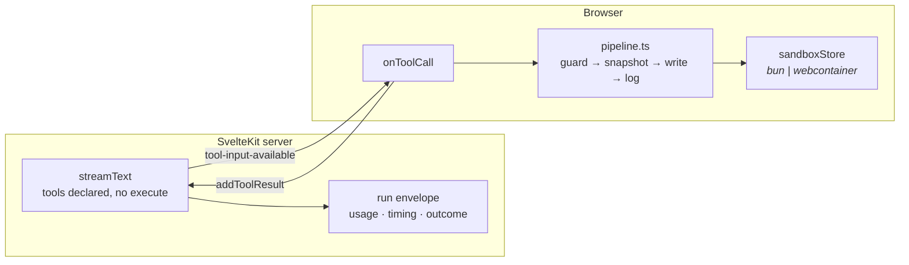

# Tool pipeline — the agent can edit files

**Status:** Shipped — both halves verified by execution
**Parent:** TRL-150 · agent harness · **Implements:** [app_builder_agent_loop_architecture.md](./app_builder_agent_loop_architecture.md) §5, and *corrects* §7
**Companion to:** [app_builder_run_envelope.md](./app_builder_run_envelope.md)
**Date:** 2026-08-29 · **Build:** `4e332b1-dirty`

---

## 1. §7 is not implementable as written

The architecture doc recommends **Option B — host-side loop**, on the reasoning that the loop can "drive the container via the existing `HarnessEnvelope` bridge." That is not possible:

| claim in §7 | reality |
|---|---|
| the host loop drives the container over `HarnessEnvelope` | `HarnessEnvelope` is **browser↔iframe** postMessage (`dir: 'guest→host'`), not server↔browser |
| the server can reach the sandbox filesystem | under the `webcontainer` backend the filesystem is **in the browser** |
| the server knows which backend is live | `sandboxStore.ts:21` — `if (!browser) return 'webcontainer'`; the server always guesses |

So the model call stays on the server (that is where usage and the run envelope live) and **tool execution happens on the client** (that is where the filesystem is). In §7's vocabulary that is Option **C**, the hybrid — arrived at by force, not preference.



**The `ExecBackend` seam §7 asks someone to build already exists.** `sandboxStore` abstracts `bun` vs `webcontainer` behind `write()` / `getFs()`. It just lives on the client — which is exactly where the tools now need it. No new seam was written.

---

## 2. What shipped

| file | role |
|---|---|
| `src/lib/agent/tools/definitions.ts` | three tool schemas — `readFile`, `writeFile`, `listFiles`. **None has `execute`**, which is what makes the SDK forward them to the client. |
| `src/lib/agent/tools/pipeline.ts` | the ordered seams: pre-execute (normalize → guard) → snapshot → execute → post-execute (log, notify) |
| `src/routes/api/chat/+server.ts` | passes `tools`, accepts `turnId`, adds the `continued` outcome |
| `src/lib/agentChatSessions.ts` | `onToolCall` → pipeline, `sendAutomaticallyWhen` for the multi-step loop, per-turn tool budget |
| `src/lib/agentHarness/pathAllowlist.ts` | **security fix** — see §4 |
| `src/lib/agentHarness/pathAllowlist.test.ts` | regression tests (`pnpm test:unit`, zero new dependencies) |

### The seams, and why they are seams

```
pre-execute   normalize → allowlist guard → (approval, not yet wired)
snapshot      BEFORE the write, so rollback restores the state being replaced
execute       sandboxStore.write / getFs().readFile
post-execute  tool log, preview notify
```

Policy grows. Rate limits, repeat-tool detection ("wrote `App.svelte` four times running"), and the approval prompt all belong in `pre-execute`, and none of them should require editing the filesystem call.

Every failure path returns a **result**, never a throw. A denied tool is a durable fact the model must see so it can adapt; swallowing it would leave the model waiting on a step that silently never happened. Outcome fields are orthogonal (`ok`, `denied`, `snapshotId`) per the harness defensive rule — never nest one failure flag inside another's branch.

### Loop termination

Client-side tools drive the loop by resubmitting, so a model that keeps calling a tool would resubmit forever, each round a real model call. `MAX_TOOL_CALLS_PER_TURN = 12`, reset when the user speaks. Exceeding it returns a tool *result* telling the model to stop and summarise — not a throw, for the same reason as above.

---

## 3. The run boundary moved, exactly as predicted

Run-envelope §6 said this would happen when tools landed:

> Once the tool pipeline lands and a turn spans multiple model calls, *request ≠ turn*, and the manifest will silently start counting steps as runs.

It does. Each client resubmit is a new HTTP request and therefore a new run. The fix is `turnId`: minted once per user message, sent with every request in that turn.

- group by `runId` → one model call
- group by `turnId` → one turn

`runId` and `sessionId` were already on the record specifically so this would be a change of *boundary*, not of schema. It was.

### A defect this surfaced: `empty` was wrong

The first real tool call recorded `outcome: "empty"`. It was not empty — it emitted a tool call and produced no text, because it handed off to the client.

Left alone, **every tool-using step would have scored as a failure**, and any success rate computed from the manifest would be wrong in proportion to how much the agent used tools. Added `continued` to `RunOutcome`:

```ts
event.toolCalls.length > 0 && event.finishReason === 'tool-calls' ? 'continued' : …
```

This is the finding-semantics argument again at a third layer: do not collapse distinct states into one bucket. `continued` ≠ `empty` ≠ `success`.

---

## 4. Security fix: path traversal in the write guard

`isGuestPathWritable` matched the allowlist against a path whose `..` segments were **not yet resolved**. `normalizeGuestPath` only stripped the leading slash.

```
components/../../../etc/passwd   →  matched ^components/  →  ALLOWED
components/../package.json       →  matched ^components/  →  ALLOWED
/components/../../.env           →  matched ^components/  →  ALLOWED
```

**Severity changed with this work.** The hole was latent while paths came from `editComponent.ts` — human-chosen and fixed. The tool pipeline lets a *model* supply the path, which makes it reachable.

Fixed at the source so every caller benefits: `normalizeGuestPath` now resolves `.` and `..` (and backslash separators) before matching, and returns `''` for anything escaping the root — escaping is *not representable* rather than merely disallowed.

Six regression tests cover it. Run with `pnpm test:unit`.

> **Lesson.** A guard is only as good as the form of the input it inspects. Normalise first, then match — matching a raw string against a prefix pattern is checking what the caller *typed*, not where the write will *land*. And re-audit every guard when the thing supplying its input changes from a human to a model.

---

## 5. Verification

| check | result |
|---|---|
| `vite build` | passes (client + server) |
| `svelte-check` filtered to touched files | clean |
| `pnpm test:unit` | 6/6 pass |
| model emits a tool call | **verified** — `tool-input-available`, `toolName: "writeFile"`, `path: "components/Hello.svelte"`, valid Svelte 5 body |
| `turnId` recorded | verified |
| `toolCalls` metric non-zero | **verified — `toolCalls: 1`**, no longer structurally zero |
| `continued` outcome | verified on a second turn |
| client half: `runTool` → `sandboxStore.write` | **verified** — `e2e/tool-pipeline.spec.ts`, 6/6 against a live Bun sandbox; file written through the pipeline read back off disk |

Both halves now execute. `e2e/tool-pipeline.spec.ts` drives `runTool` in the page against a real sandbox and asserts the file lands on disk, plus the four denial paths.

It calls the pipeline directly rather than prompting the model: routing through the model would test the model's *willingness* to call a tool, which is neither deterministic nor the thing under test.

**Fixture note.** The first version created a project per test; the second test then hung 300s failing to find the dashboard's "New project" button — five sandbox boots the assertions did not need. One shared project took the suite from **5.1 minutes (1 passed, 1 failed, 3 unrun)** to **4.9 seconds, 6/6**. The cost is isolation between assertions, paid for by giving each its own write path.

**Still unverified:** the full UI path — a user typing a prompt and the model's tool call reaching `onToolCall` through the chat panel. Every layer is covered individually; their composition through the Svelte component is not.

---

## 6. Next

1. ~~**Phase 1, the `SessionEvent` log.**~~ **Done** — see §7. The lossy `slice(-200)` is no longer the only record.
2. ~~**Point the tool-log *view* at the durable log.**~~ **Done** — see §8. The tool-log panel now reads the complete durable record via `liveQuery`, and is surfaced in the live `agent-pane` (it was orphaned on a dead singleton before).
3. **One full-UI turn** — partly done. The *interactive* composition (prompt → click → disk) is now covered by `e2e/approval-flow.spec.ts` (§9). Still uncovered: the model half — composer text → `/api/chat` → `onToolCall` — which needs either a live model or a mocked AI-SDK stream, and tests the model's willingness rather than the composition.
4. ~~**The approval seam**~~ **Done** — see §9. Writes prompt before landing, "allow all" is turn-scoped, and it fails closed.
5. ~~**Phase 2 — the assistant plane.**~~ **Done** — see §10. The log now folds a full transcript (user + assistant + tools).
6. **Re-run the think-mode experiment.** `steps` and `toolCalls` are no longer pinned at zero, so the corpus can finally contain multi-step tasks — the gap that made the first evaluation's conclusion non-generalisable.
7. **Resume/fork from the log** (architecture-doc Phase 6) — now unblocked: with the assistant plane captured, a session can be reconstructed from the durable log instead of ai-sdk's in-memory `Chat.messages` + the localStorage transcript.

---

## 10. Phase 2: the assistant plane

Architecture-doc §7 recommended "Option B — host-side loop." §1 of this doc showed that isn't implementable (tools must run client-side); the shipped shape is the hybrid — model on the server, tools + loop on the client via ai-sdk's `sendAutomaticallyWhen` resubmit. So "Phase 2 = host loop" reduces, in the real architecture, to the one thing the durable log was still missing: **the assistant side of the turn.** With it, the whole conversation reconstructs from one list.

| file | change |
|---|---|
| `src/lib/agentChatSessions.ts` | `onFinish` appends `assistant/message` (text + `stepId = message.id`); `onToolCall` now stamps `stepId` on `tool/call` / `tool/result` — the step is the assistant message that emitted the call. |
| `src/lib/agent/session/events.ts` | `selectTranscript` folds `user/message` + `assistant/message` into an ordered transcript. |
| `src/lib/agent/session/events.test.ts` | +2 transcript tests (order preserved, tool events dropped, empty-log case). |

**Design commitments, and why.**

- **The live view stays on ai-sdk; the log stays the record.** Streaming deltas remain in the live plane — the transcript UI keeps rendering `Chat.messages` for real-time tokens. The durable log captures the *coalesced* `assistant/message` at step end. Swapping the live render to the log would have traded streaming for durability; the two-plane split keeps both.
- **`onFinish` fires per step, so text-less tool steps are skipped.** A pure tool-call step produces no assistant text; recording an empty `assistant/message` would just be noise beside the `tool/*` events already logged. Only steps with real text land.
- **Usage is not duplicated.** Token usage is not on the client message — it is authoritative in the server run envelope (`recordRun`). The log carries text + `stepId`; `selectUsageTotals` folds usage only if a future server-authored path adds it.
- **`stepId` binds a tool call to the assistant message that emitted it.** `tool/call`, `tool/result`, and the emitting `assistant/message` now share one `stepId` — the definition of a step (one model request + its tool calls) is finally represented in the data.

**Verified:** `node --test` 23/23; `vite build` passes (client + server); touched files clean under `svelte-check`. End-to-end capture of `assistant/message` needs a live model turn (Ollama) and is not in the deterministic e2e; the fold is unit-covered and the append path is the same fire-and-forget one the tool events already proved through `approval-flow.spec.ts`.

---

## 9. The approval seam

Implements architecture-doc §6. An agent editing the user's files now asks before a write lands, resolved inside `pre-execute` — after the allowlist guard (no point prompting for a write that would be denied anyway) and before the snapshot/write.

| file | role |
|---|---|
| `src/lib/agent/approval/policy.ts` | pure decision matrix: `precheckApproval` / `immediateDecision` / `decisionForResolution` / `summarizeWrite`. Rune- and Dexie-free, so the security logic runs under `node --test`. |
| `src/lib/agent/approval/policy.test.ts` | 8 tests over the fail-closed matrix and turn-scoping. |
| `src/lib/agent/approval/approvalStore.svelte.ts` | live-plane runes store: one outstanding prompt + a per-turn "allow all", plus the promise the pipeline awaits. |
| `src/lib/components/agent-approval-prompt.svelte` | the `[Allow] [Allow all this turn] [Deny]` prompt; denies on unmount. |
| `src/lib/agent/tools/pipeline.ts` | `runTool(name, input, ctx)` — `ctx.turnId` gates the prompt; a denial returns a durable-visible `deny(...)`. |
| `src/lib/agentChatSessions.ts` | threads `{ turnId }` into `runTool`; `beginTurn` clears the standing grant. |
| `src/lib/components/agent-pane.svelte` | renders the prompt; "Auto-approve writes" menu toggle for the mode. |

**Design commitments, and why.**

- **Fail closed.** Every branch that is not an explicit allow resolves `deny` — auto-allow off + no grant + a prompt already pending (`deny-busy`) all deny. A prompt still open when the pane unmounts is denied via `onDestroy`, so the loop can't hang on a vanished prompt.
- **"Allow all" is turn-scoped, and enforced twice.** `precheckApproval` only honors a grant when `allowAllTurnId === reqTurnId` (a new turn mints a new id and can't match), and `beginTurn` also calls `resetApprovalTurn()`. Belt and suspenders on the one piece of state that could over-permit.
- **A denial is durable.** `deny(...)` returns `{ ok:false, denied:true }`, which the caller already logs as `tool/result {ok:false}` — so the model sees the refusal and adapts rather than stalling.
- **Only writes, only in a turn.** Reads/`listFiles` never prompt. A direct `runTool` call with no `turnId` (the e2e suite, internal tooling) bypasses the prompt entirely — the interactive gate is for the interactive path.
- **The security-relevant half is the pure, tested half.** The runes store is plumbing; the decisions live in `policy.ts`, which is where a regression would bite and where the tests sit.

**Verified:** `node --test` 21/21 (8 approval + 7 session + 6 allowlist); `vite build` passes (client + server); touched files clean under `svelte-check`.

### Full-UI composition — `e2e/approval-flow.spec.ts`

The direct pipeline spec proves `runTool` → disk in isolation; it cannot reach the *interactive* composition — a gated write actually raising the prompt component, a real click resolving it, the decision flowing back to the filesystem. This spec does, through the running page:

| test | asserts |
|---|---|
| Allow lets the write land | prompt renders with the target path, click Allow → `ok`, file on disk |
| Deny blocks the write | click Deny → `denied`, no snapshot, **no file** |
| "Allow all this turn" | first write prompts; second write in the same turn settles with **no prompt** |
| grant does not carry over | a new turn prompts again — the turn-scoping holds end to end |

**How it drives the real prompt without the model:** a `runTool(..., { turnId })` kicked off inside the page parks on `requestApproval`, which sets the global `approvalState.pending`; the mounted `<AgentApprovalPrompt/>` reads the *same* module instance (Vite dedupes the page's dynamic import against the app graph, the same singleton assumption the sibling spec makes for `sandboxStore`), so Playwright clicks the actual button. Routing through the model was avoided on purpose: it would test the model's willingness to call a tool, not the composition. **4/4 pass (3.3s against the live sandbox).**

---

## 8. The tool-log view now reads the durable log

Closes the omission bug on the *rendering* side. Two findings surfaced while wiring it:

- **The `ToolLog` component was orphaned.** It lived only in `agent-rail.svelte` / `chat-pane.svelte`, both of which import the *dumb singleton* `$lib/chat.svelte` (no `onToolCall`, no tools) — and neither is mounted anywhere. The live, tool-enabled surface, `agent-pane.svelte` (keyed by `sessionId`, uses `agentChatSessions`), rendered **no** tool log at all. So "swap the view" was really "give the working surface a working tool log."
- **`harnessStore.toolLog` was never the right source for it.** It is the live plane by design. The panel now subscribes to the durable log.

| file | change |
|---|---|
| `src/lib/agent/session/log.ts` | adds `observeSessionEvents(sessionId)` — a Dexie `liveQuery` that re-emits the full ordered event list on every append. |
| `src/lib/components/tool-log.svelte` | renders `selectToolLog(events)` from that subscription instead of `harnessStore.toolLog`. `sessionId` is an optional prop; absent (the legacy rail) means no session, so it shows empty and never subscribes. |
| `src/lib/components/agent-pane.svelte` | the "Agent logs" menu item (was a `showWip` stub) now toggles an inline `<ToolLog {sessionId} />` between transcript and composer. |

**Why `liveQuery` rather than a manual refetch:** Dexie re-runs the query on any table write and pushes the new result, so the view is complete by construction and cannot drift from the log — the same "one source, derived views" invariant, now enforced by the query layer instead of by hand.

**Verified:** `vite build` passes (client + server); `node --test` 13/13; touched files clean under `svelte-check`.

---

## 7. Phase 1 shipped: the durable `SessionEvent` log

Implements architecture-doc §2 (one session-event log) and §3 (two planes). The live plane stays exactly as it was; a durable plane now sits underneath it.

| file | role |
|---|---|
| `src/lib/agent/session/events.ts` | Dexie-free domain: the `SessionEvent` union + pure fold selectors (`selectToolLog`, `selectLastWrite`, `selectUsageTotals`). Runs under `node --test`. |
| `src/lib/agent/session/log.ts` | the only DB-touching module: `appendSessionEvent` / `readSessionEvents` / `clearSessionEvents`. Best-effort — a Dexie failure is logged and swallowed, never thrown into the loop. |
| `src/lib/agent/session/events.test.ts` | 7 selector tests (drift-can't-happen, denied ≠ error, last-write ignores denied attempts). |
| `src/lib/webcontainerSnapshot.ts` | Dexie `version(5)` adds `sessionEvents: '++seq, sessionId, turnId, ts, kind'`, additive. |
| `src/lib/agentChatSessions.ts` | emits `turn/start` + `user/message` on send, and `tool/call` → `tool/result` (+ `fs/observed`) around each run. |
| `src/lib/agent/tools/pipeline.ts` | `ToolRunResult` gains `observed?: { path, op }`, so the caller records the effect the pipeline *saw*, not a guess parsed from `output`. |

**Design commitments, and why.**

- **Append-only; `seq`/`ts` assigned by the log, never the caller.** Ordering can't be forged by a replay. `seq` is Dexie's `++seq` (monotonic); per-session order is ascending `seq` within a `sessionId`.
- **The durable writes are fire-and-forget (`void`).** A durable-log round-trip must not delay the tool result the loop is blocked on. Order still holds — Dexie `add`s run in issue order — so `tool/call` always precedes its `tool/result`.
- **`tool/call` is logged *before* execution.** A crash mid-write still leaves the request on record.
- **Every view is a fold, so drift isn't representable.** Transcript, tool log, last-write badge, and usage totals all derive from one list.
- **`stepId` is optional and currently unset.** A client-executed tool knows its turn and call id but not which model step emitted it — that binding is Phase 2 (host loop). A fabricated value would lie; the gap is admitted instead.

**Verified:** `node --test` 13/13 (7 new + 6 allowlist); `vite build` passes (client + server); touched files clean under `svelte-check` (the `.ts`-import notice on the test file is the same pre-existing one `pathAllowlist.test.ts` carries — required by `node --test` type stripping).
