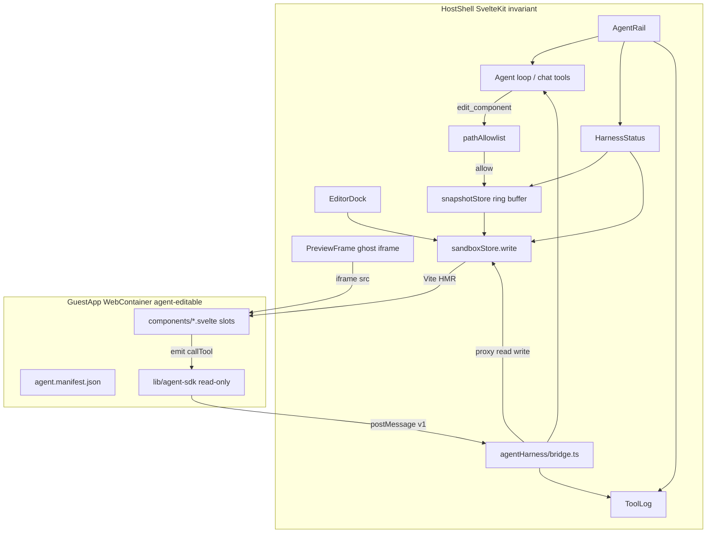

# TRL-152 — Spec: app-builder self-authoring agent harness

**Parent:** TRL-151 (design) · TRL-150 (proposal)  
**Design:** [app_builder_agent_harness_design.md](../../artifacts/app_builder_agent_harness_design.md) · [mockup](../../artifacts/app_builder_agent_harness_mockup.html)

## Problem

App-builder boots a Svelte REPL (editor + preview + terminal) but has no **agent harness** — no structured loop for an agent to hot-write guest Svelte components, observe guest UI events, or roll back bad edits. The host shell and guest app share a sandbox but lack a versioned SDK boundary, path allowlist, snapshot/rollback, or AgentRail chrome.

## Architecture



**Dependency rule:** Host modules live under `src/lib/agentHarness/` and `src/lib/components/agent-*`. Guest SDK is **injected at mount** via `webcontainerProject.ts` — never edited by agent tools. Host SvelteKit routes and layout chrome are **out of scope** for agent writes in v1.

## Module layout (normative)

```
src/lib/agentHarness/
  types.ts              # HarnessEnvelope, ToolLogEntry, SnapshotRecord
  pathAllowlist.ts      # isGuestPathWritable(path) → boolean
  snapshotStore.ts      # ring buffer (in-memory v1, max 32)
  bridge.ts             # window message listener + guest RPC dispatch
  harnessStore.svelte.ts # lastWrite, hmrMs, snapshots, toolLog, railCollapsed
  editComponent.ts      # edit_component tool impl (snapshot → allowlist → write)

src/lib/components/
  agent-rail.svelte     # 320px panel: chat slot + HarnessStatus + ToolLog
  harness-status.svelte # phase, last path, snapshot id, rollback btn
  tool-log.svelte       # structured event list (emit, deny, rollback, hmr)

Guest mount (via createWebContainerMount):
  agent.manifest.json
  lib/agent-sdk/index.ts   # emit, callTool, subscribe, getContext
  lib/agent-sdk/types.ts
  components/.gitkeep
  App.svelte               # slot scaffold: main | sidebar | status
```

## SDK envelope (v1)

All host ↔ guest messages use:

```ts
type HarnessEnvelope =
  | { v: 1; dir: 'guest→host'; type: 'emit'; payload: { name: string; data?: unknown } }
  | { v: 1; dir: 'guest→host'; type: 'call'; id: string; method: 'read' | 'write'; args: { path: string; content?: string } }
  | { v: 1; dir: 'host→guest'; type: 'call-result'; id: string; ok: boolean; result?: unknown; error?: string }
  | { v: 1; dir: 'host→guest'; type: 'context'; payload: Record<string, unknown> };
```

- Guest SDK `emit(name, data)` → `guest→host emit` → ToolLog + agent observation channel.
- Guest SDK `callTool('read', { path })` → host proxies to `sandboxStore` FS read; deny if path blocked.
- `write` via callTool is **denied in v1** — agent uses host `edit_component` only.
- Unknown `v` or `type` → bridge ignores (no throw).

Extend existing `REPL_INDEX_HTML` console `postMessage` hook in `replProject.ts` to also forward `{ v:1, dir:'guest→host', type:'emit', ... }` from SDK — prefix log lines `[iframe-ui]` for UI events, keep `[iframe-error]` for compile/runtime errors.

## pathAllowlist (normative)

```ts
// Writable by agent + human editor (guest zone)
/^(\/)?(App\.svelte|components\/|agent\.manifest\.json)/

// Always denied
/lib\/agent-sdk\//
/^package\.json$|^vite\.config|^svelte\.config|^index\.html$|^main\.js$/
```

On deny: `toast.error`, append ToolLog `{ kind: 'deny', path }`, return `{ ok: false }` from `edit_component` — **no write**.

## snapshotStore (normative)

- In-memory ring buffer, max **32** entries.
- Each snapshot: `{ id: string; ts: number; files: Record<string, string> }` — capture **all guest-writable paths** currently in sandbox FS before each allowed agent write.
- `rollback(id)` restores files via sequential `sandboxStore.write`; ToolLog `{ kind: 'rollback', id }`.
- HarnessStatus shows latest snapshot id + last-write path + HMR latency (ms from write to next preview-ready signal).

## AgentRail (normative)

Mount in `(app)/+layout.svelte` workspace row — **sibling** to `{@render children()}`, not inside HorizonLayout (avoids dock tab churn):

```svelte
<div class="app-shell__workspace …">
  <div class="flex min-h-0 flex-1 …">{@render children()}</div>
  <AgentRail collapsed={harnessStore.railCollapsed} onToggle={…} />
</div>
```

| State | Width | Behavior |
| ----- | ----- | -------- |
| open | 320px | chat + HarnessStatus + ToolLog visible |
| collapsed | 48px | icon strip; `aria-expanded={false}` |
| `<1024px` + open | overlay | drawer over preview (`position: fixed; right: 0`), not push |

Reuse existing `chat` from `$lib/chat.svelte.ts` in AgentRail composer region. ToolLog empty state: "No agent events yet".

## PreviewFrame deltas

| File | Change |
| ---- | ------ |
| `previewFrame.ts` | `iframe.title = 'Agent guest preview'` |
| `previewFrame.ts` | Optional `--agent-glow` border on iframe for 2s after agent write (`prefers-reduced-motion`: instant tint) |
| `preview-panel.svelte` | Badge: "guest · read-only SDK" when live |

## Mount contract (normative)

Update `createWebContainerMount()`:

1. Add `agent.manifest.json` default `{ "version": 1, "slots": ["main", "sidebar", "status"] }`.
2. Add `lib/agent-sdk/index.ts` + `types.ts` (host-authored, injected).
3. Add `components/.gitkeep`.
4. Replace `App.svelte` bootstrap with slot scaffold importing `./components/*` as agent adds them.
5. Bun backend: mirror same tree in sandbox boot payload (`server/` mount path).

Default `App.svelte` keeps counter demo in `main` slot per design.

## Agent tool: edit_component

Wire to chat/API tool surface (or `appActions` stub for v1 manual invoke):

```ts
edit_component({ path: string; content: string }) → { ok: boolean; snapshotId?: string; denied?: boolean }
```

Flow: `pathAllowlist` → `snapshotStore.capture()` → `sandboxStore.write()` → update `harnessStore.lastWrite` → HMR observe.

## Integration map

| Existing | Harness use |
| -------- | ------------- |
| `sandboxStore.ts` | Unified write/boot for WC + Bun |
| `webcontainerProject.ts` | Mount tree + SDK injection |
| `replProject.ts` | Extend iframe postMessage forwarding |
| `previewFrame.ts` | iframe title + glow |
| `preview-pane.svelte` | Toolbar badge pattern |
| `chat.svelte.ts` | AgentRail composer |
| `actionSnapshots.ts` | Pattern reference only — harness uses separate guest snapshotStore |

## Out of scope (v1)

- Agent editing host SvelteKit routes or `src/lib/agentHarness/*`
- Guest `callTool('write')` — host `edit_component` only
- Dexie persistence for snapshots (in-memory only v1)
- SDK Button/Panel primitives
- Full agent loop / MCP tool registration (stub OK; bridge + UI must work)

## Acceptance criteria

### Machine (`trellis test:`)

- `test:test -f Projects/Sandbox/svelte-wc/app-builder/docs/issues/TRL-151/summary.md`
- `test:grep -q agentHarness Projects/Sandbox/svelte-wc/app-builder/docs/issues/TRL-151/summary.md`
- `test:grep -q postMessage Projects/Sandbox/svelte-wc/app-builder/docs/issues/TRL-151/summary.md`
- `test:grep -q agent-rail Projects/Sandbox/svelte-wc/app-builder/docs/issues/TRL-151/summary.md`
- `test:grep -q pathAllowlist Projects/Sandbox/svelte-wc/app-builder/docs/issues/TRL-151/summary.md`
- `test:grep -q snapshotStore Projects/Sandbox/svelte-wc/app-builder/docs/issues/TRL-151/summary.md`
- `test:grep -q agent.manifest.json Projects/Sandbox/svelte-wc/app-builder/docs/issues/TRL-151/summary.md`
- `test:grep -q agent-harness.spec.ts Projects/Sandbox/svelte-wc/app-builder/docs/issues/TRL-151/summary.md`
- `test:node Projects/Sandbox/svelte-wc/app-builder/docs/artifacts/verify-app-builder-agent-harness-tokens.mjs`

### Behavioral (Executor)

1. **AgentRail** renders chat composer, HarnessStatus, and ToolLog; collapses 320px ↔ 48px with `aria-expanded`.
2. Preview iframe `title` is **Agent guest preview**.
3. `edit_component` on `lib/agent-sdk/index.ts` → deny + toast + ToolLog `[deny]`; guest unchanged.
4. Allowed write to `components/TaskPanel.svelte` → preview HMR updates; HarnessStatus shows path + HMR ms.
5. Guest `emit('click', payload)` → ToolLog structured entry visible in AgentRail.
6. Guest `callTool('read', { path: '/App.svelte' })` → resolves content in guest.
7. Rollback restores pre-write guest files; preview reverts.
8. `pnpm build` exits 0 after impl.
9. Design token parity script still exits 0.

### Impl verification (Executor — not spec gate)

- `grep -q lib/agent-sdk src/lib/webcontainerProject.ts`
- `grep -q 'Agent guest preview' src/lib/previewFrame.ts`
- `grep -q pathAllowlist src/lib/agentHarness/pathAllowlist.ts`

## E2e spec (`e2e/agent-harness.spec.ts`)

Executor adds Playwright if missing (`@playwright/test`, `playwright.config.ts`, `test:e2e` script).

Scenarios (WebContainer mode — `PUBLIC_SANDBOX_BACKEND=webcontainer`):

1. Navigate `/editor` → AgentRail visible; ToolLog shows idle placeholder.
2. Toggle AgentRail collapse → width changes; `aria-expanded` toggles.
3. Mock/stub agent write to guest component → HarnessStatus shows last path (or use test hook exposing `harnessStore`).
4. Deny write to SDK path → toast or ToolLog deny entry (no preview change).

Run:

```bash
PUBLIC_SANDBOX_BACKEND=webcontainer pnpm test:e2e e2e/agent-harness.spec.ts --workers=1
```

Defer full WebContainer boot to reviewer if CI timeout — document skip reason in impl describe.

## Files touched (expected)

- `src/lib/agentHarness/*` (new)
- `src/lib/components/agent-rail.svelte` (new)
- `src/lib/components/harness-status.svelte` (new)
- `src/lib/components/tool-log.svelte` (new)
- `src/lib/webcontainerProject.ts` (mount + SDK)
- `src/lib/replProject.ts` (message forward)
- `src/lib/previewFrame.ts` (title + glow)
- `src/routes/(app)/+layout.svelte` (AgentRail slot)
- `src/lib/initialCode.ts` (slot scaffold App.svelte if needed)
- `e2e/agent-harness.spec.ts` (new)
- `package.json` (playwright + test:e2e if missing)

## Implementation notes

| Area | Required | Common drift |
| ---- | -------- | ------------ |
| Two-shell | Guest only in WC mount | Agent edits host routes |
| SDK | Injected read-only | Agent can overwrite SDK |
| Snapshots | Before each agent write | Missing rollback |
| AgentRail | Layout sibling, not dock tab | Buried in HorizonLayout tabs |
| iframe | Ghost iframe via previewFrame | Inline iframe in panel only |
| Bun backend | Same mount tree as WC | SDK missing on Bun path |
