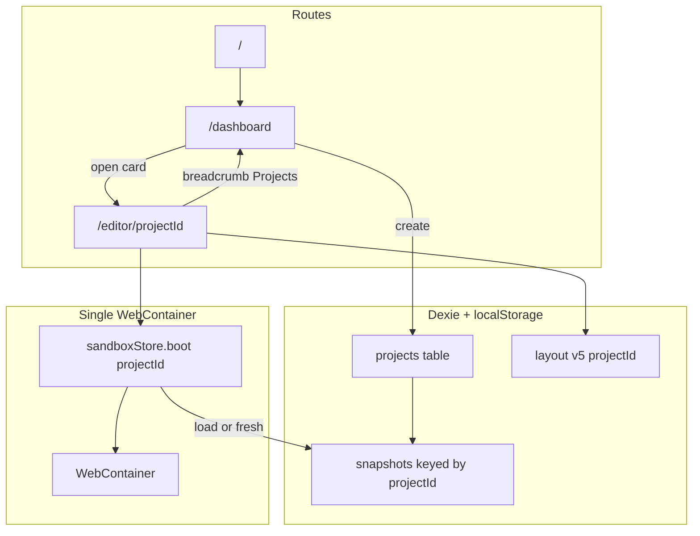

# TRL-156 — Spec: multi-project dashboard and template registry

**Parent:** TRL-155 (design) · TRL-154 (proposal)  
**Design:** [app_builder_multi_project_design.md](../../artifacts/app_builder_multi_project_design.md) · [mockup](../../artifacts/app_builder_multi_project_mockup.html)

## Problem

App-builder assumes a **single implicit project** (`svelte-repl`, Dexie snapshot id `'default'`). Users cannot create multiple sandboxes, pick frameworks, or return to a project home without losing context. The agent harness (TRL-150) is project-agnostic but not multi-tenant.

## Architecture



**Dependency rule:** Project metadata and UI live under `src/lib/projects/` and `src/routes/(app)/dashboard/`. Sandbox lifecycle changes stay in `webcontainerStore.ts` / `sandboxStore.ts`. Agent harness changes are limited to `projectId` scoping + template guard in `editComponent.ts`.

## Module layout (normative)

```
src/lib/projects/
  types.ts                 # TemplateId, ProjectRecord, CreateProjectInput
  projectStore.ts          # ProjectStore interface
  dexieProjectStore.ts     # Dexie v1 implementation
  templates/
    index.ts               # TEMPLATES registry
    svelte.ts              # createMount, defaultAppContents, entryFile
    vue.ts
    nextjs.ts              # Next-style Vite+React app/ layout

src/lib/components/
  project-card.svelte
  new-project-dialog.svelte
  project-switch-overlay.svelte

src/routes/(app)/
  dashboard/+page.svelte
  editor/[projectId]/+page.svelte
  editor/+page.svelte      # redirect shim → last project or /dashboard
```

## Data model (normative)

```ts
type TemplateId = 'svelte' | 'vue' | 'nextjs';

type ProjectRecord = {
  id: string;
  name: string;
  templateId: TemplateId;
  createdAt: number;
  updatedAt: number;
  lastOpenedAt: number;
  trellisRepoId?: string;
  trellisEntityId?: string;
};

type ProjectTemplate = {
  id: TemplateId;
  label: string;
  description: string;
  entryFile: string;
  snapshotVersion: string;
  defaultAppContents: string;
  createMount(appContents: string): FileSystemTree;
};
```

### Dexie schema v2 (`app-builder-webcontainer`)

| Table | Key | Fields |
| ----- | --- | ------ |
| `projects` | `id` | ProjectRecord columns |
| `snapshots` | `id` (= projectId) | `version`, `templateId`, `data`, `updatedAt` |

Migration on first `listProjects()`:

1. If `projects` has rows → done
2. Else if snapshot `id === 'default'` exists → create `My Svelte App` (`templateId: 'svelte'`), copy snapshot to new `projectId`, delete `'default'`
3. Else → no auto-create (empty dashboard until user creates)

## ProjectStore API (normative)

```ts
interface ProjectStore {
  list(): Promise<ProjectRecord[]>;
  get(id: string): Promise<ProjectRecord | null>;
  create(input: { name: string; templateId: TemplateId }): Promise<ProjectRecord>;
  update(id: string, patch: Partial<Pick<ProjectRecord, 'name'>>): Promise<void>;
  delete(id: string): Promise<void>;
  touch(id: string): Promise<void>;
  duplicate(id: string): Promise<ProjectRecord>;
}
```

`duplicate` copies `ProjectRecord` + snapshot row (new id).

## Routes (normative)

| Route | Behavior |
| ----- | -------- |
| `/` | `redirect(302, '/dashboard')` or `(app)` layout redirect |
| `/dashboard` | Project grid; AgentRail collapsed by default |
| `/editor/[projectId]` | Editor + `sandboxStore.boot(projectId)` |
| `/editor` | Redirect to `localStorage` last project id or `/dashboard` |

## Sandbox lifecycle (normative)

Extend `sandboxStore` / `webcontainerStore`:

```ts
boot(projectId: string): Promise<void>
saveActiveProject(): Promise<void>   // flush snapshot for current id
switchProject(fromId: string | null, toId: string): Promise<void>
```

**`boot(projectId)` flow:**

1. Resolve `ProjectRecord` + `ProjectTemplate`
2. `loadCachedSnapshot(projectId, template.snapshotVersion)` — if valid, mount + dev server
3. Else `freshInstall` with `template.createMount(template.defaultAppContents)`
4. Set status bar workspace label to `project.name`
5. Reset agent `snapshotStore` ring buffer for `projectId`

**Leave editor / open another project:**

1. `saveCachedSnapshot(container, projectId)` — tag in-flight saves; ignore stale completions
2. `container.teardown()`, clear `__appBuilderWcInit`
3. Boot target `projectId`

**Switch overlay:** `project-switch-overlay.svelte` — phases `Saving…` | `Restoring…` | `Installing…`; `role="status"` `aria-live="polite"`; workspace `aria-busy="true"`.

## Per-project editor state (normative)

| Key pattern | Module |
| ----------- | ------ |
| `app-builder:layout:v5:{projectId}` | `editorLayout.ts` |
| `app-builder:dock-containers:v2:{projectId}` | `containerTabs.svelte.ts` |
| `app-builder:tab-names:v2:{projectId}` | `tabNames.svelte.ts` |
| `app-builder:file-tree:v2:{projectId}` | `fileTreeState.svelte.ts` |
| `app-builder:last-project-id` | redirect shim |

Editor seeds `openFiles` / `activeFile` from `template.entryFile`.

## Template registry (normative)

| id | entryFile | Agent harness |
| -- | --------- | ------------- |
| `svelte` | `App.svelte` | Full (TRL-150) |
| `vue` | `App.vue` | Preview only — `edit_component` deny |
| `nextjs` | `app/page.tsx` | Preview only — label UI "Next-style" |

`nextjs` template: Vite + React with `app/` folder — **not** `next dev`.

Refactor existing Svelte mount from `webcontainerProject.ts` into `templates/svelte.ts`. Keep `initialCode` as re-export of svelte default.

## Navigation chrome (normative)

1. **Icon rail** — `LayoutDashboard` → `/dashboard` above Editor; active when pathname starts `/dashboard`
2. **Editor breadcrumb** — `{ label: 'Projects', href: '/dashboard' }` then `{ label: project.name }` then file segments
3. **Status bar** — left segment shows `project.name` (replace hardcoded `svelte-repl`)

## Agent harness (normative delta)

`editComponent.ts` — before allowlist:

```ts
if (activeTemplateId !== 'svelte') {
  appendToolLog({ kind: 'deny', summary: '[deny] template', path: normalized });
  return { ok: false, denied: true };
}
```

`snapshotStore.ts` — `setActiveProjectId(id)` clears ring buffer on switch.

Expose `getActiveProjectId()` from a small `projectContext.svelte.ts` or route-derived store.

## UI components (normative)

| Component | Requirements |
| --------- | ------------ |
| `project-card.svelte` | Badge by template; menu Open/Rename/Duplicate/Delete; card click navigates |
| `new-project-dialog.svelte` | shadcn Dialog; radiogroup templates; Create disabled until name.trim() |
| `project-switch-overlay.svelte` | Scrim over workspace only |
| `dashboard/+page.svelte` | h1 Projects; empty state when list empty |

## Out of scope (v1)

- Trellis npm dependency / `core:App` registry
- Bun backend multi-project mapping
- Python, game, notes templates
- Cloud sync, share
- Concurrent multi-project WC in one tab

## Acceptance criteria

```text
test:pnpm run check
test:test -f docs/issues/TRL-155/summary.md
test:grep -q ProjectStore docs/issues/TRL-155/summary.md
test:grep -q projectId src/lib/webcontainerSnapshot.ts
test:grep -q dashboard src/routes/(app)/dashboard/+page.svelte
test:grep -q project-card src/lib/components/project-card.svelte
test:grep -q templates/svelte src/lib/projects/templates/svelte.ts
test:grep -q templates/vue src/lib/projects/templates/vue.ts
test:grep -q templates/nextjs src/lib/projects/templates/nextjs.ts
test:grep -q LayoutDashboard src/lib/components/icon-rail.svelte
test:grep -q "kind: 'deny'" src/lib/agentHarness/editComponent.ts
test:grep -q template src/lib/agentHarness/editComponent.ts
test:node docs/artifacts/verify-app-builder-multi-project-tokens.mjs
test:test -f e2e/multi-project.spec.ts
test:PUBLIC_SANDBOX_BACKEND=webcontainer pnpm test:e2e e2e/multi-project.spec.ts --workers=1
```

### e2e scenarios (`e2e/multi-project.spec.ts`)

1. `/dashboard` shows Projects heading and New project button
2. Create Svelte project via dialog → lands on `/editor/[id]`
3. Navigate dashboard via icon rail → project card visible
4. Open Svelte project → AgentRail visible (harness smoke)

Defer full WC boot timeout failures — document skip in describe if CI flakes (same as TRL-152).

## File touch list

**New:** `src/lib/projects/**`, `dashboard/+page.svelte`, `editor/[projectId]/+page.svelte`, `project-card`, `new-project-dialog`, `project-switch-overlay`, `e2e/multi-project.spec.ts`

**Modify:** `webcontainerSnapshot.ts`, `webcontainerStore.ts`, `sandboxStore.ts`, `webcontainerProject.ts`, `icon-rail.svelte`, `statusBar.svelte.ts`, `editorLayout.ts`, `containerTabs.svelte.ts`, `tabNames.svelte.ts`, `fileTreeState.svelte.ts`, `editComponent.ts`, `snapshotStore.ts`, `editor/+page.svelte` (redirect)
