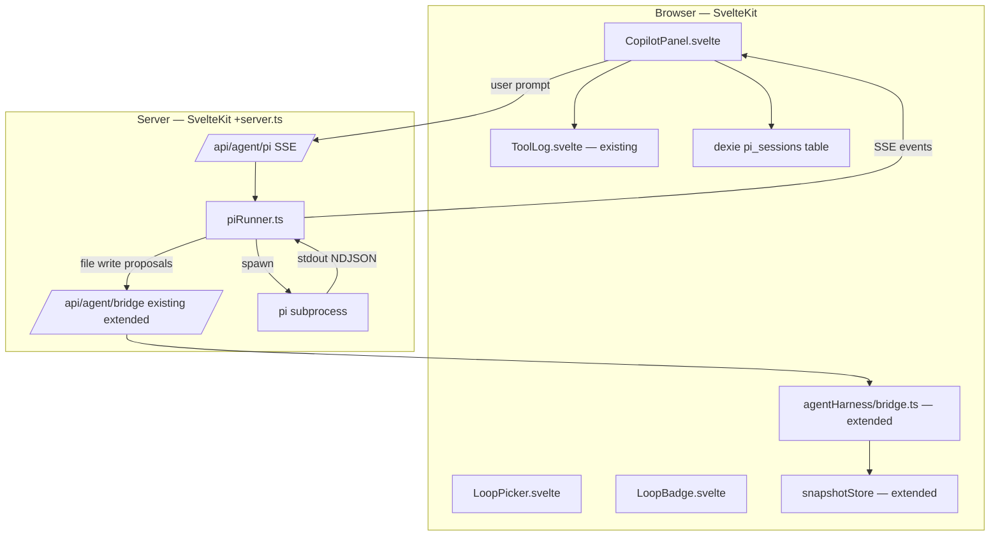

# TRL-158 — Spec: app-builder CLI co-pilot (pi in the chat pane)

**Parent:** TRL-157 (design) · TRL-156 (proposal)
**Design:** [app_builder_cli_copilot_design.md](../../artifacts/app_builder_cli_copilot_design.md)

## Problem

App-builder's `AgentRail` (TRL-152) ships a visual agent loop that hot-edits guest Svelte components through a `bridge.ts` allowlist. There is no path to run an **external CLI coding agent** (Anthropic's `@earendil-works/pi-coding-agent`, OpenCode, Claude Code) in the same pane. Users who want CLI-shaped work (multi-file refactor, scripted edits, run-build-fix) leave the IDE, lose the bridge's allowlist + snapshot guarantees, and re-establish a different trust boundary in a terminal.

This spec embeds the **pi** CLI as a peer loop in the existing `AgentRail` and routes every file write through the same `bridge.ts` allowlist and `snapshotStore` ring buffer. The visual harness and pi become **two loops sharing one kernel**.

## Architecture



**Dependency rule:** `CopilotPanel` consumes `ToolLog` (existing), `LoopBadge` (new), `LoopPicker` (new). `piRunner` depends only on `child_process`, `readline`, and the existing `bridge.ts` allowlist — never on WebContainer. The Dexie schema bump to v3 is additive only; v1/v2 readers still work.

## Module layout (normative)

```
src/lib/agentHarness/
  bridge.ts                      # +loop: 'harness'|'pi' on every body
  allowlist.ts                   # +piEditRoots config + piCommandAllowlist
  snapshotStore.ts               # +tag: 'harness'|'pi' on ring entries
  types.ts                       # +LoopKind, widen AgentMessage
  piAdapter.ts                   # NDJSON → bridge calls (browser side, just for shape)

src/lib/components/
  AgentRail.svelte               # refactor: hosts CopilotPanel
  copilot/
    CopilotPanel.svelte          # chat list + composer + loop picker
    LoopBadge.svelte             # harness|pi origin badge
    LoopPicker.svelte            # which loop receives the next prompt
    PiSessionStatus.svelte       # pid, last event age, kill

src/lib/
  dexie.ts                       # v3 schema: +pi_sessions table

server/
  agent/
    piRunner.ts                  # subprocess lifecycle, NDJSON parse, backpressure
  routes/api/agent/
    pi/+server.ts                # POST: start|resume|cancel; returns SSE
    pi/[sessionId]/+server.ts    # DELETE: kill
    bridge/+server.ts            # +loop field on bodies

e2e/
  copilot-pi.spec.ts             # smoke + allowlist + resume
```

## Data model (normative)

```ts
type LoopKind = 'harness' | 'pi'

type AgentMessage = {
  id: string
  loop: LoopKind // NEW
  role: 'user' | 'assistant' | 'tool'
  content: string
  toolCallId?: string
  toolName?: string
  toolInput?: unknown
  toolOutput?: string
  denied?: boolean // when bridge refused the write
  createdAt: number
}

type PiSession = {
  id: string // local uuid
  projectId: string // FK to ProjectRecord (TRL-156)
  piSessionId?: string // pi's own resume token (set after first event)
  pid?: number // subprocess pid
  status: 'idle' | 'running' | 'completed' | 'error' | 'killed'
  startedAt: number
  lastEventAt: number
  messages: AgentMessage[]
  exitReason?: 'complete' | 'cancelled' | 'error' | 'max_steps'
  costUsd?: number // see ADR §6.5 — optional, populated by parser
}
```

### Dexie schema v3 (`app-builder-webcontainer`)

| Table         | Key  | Fields            | Notes                                  |
| ------------- | ---- | ----------------- | -------------------------------------- |
| `pi_sessions` | `id` | PiSession columns | NEW; indexed on `projectId` + `status` |
| `projects`    | `id` | unchanged         | v2                                     |
| `snapshots`   | `id` | unchanged         | v2                                     |

Migration on first `listPiSessions()`: create `pi_sessions` if missing; no backfill required (greenfield).

### Allowlist additions

```ts
// src/lib/agentHarness/allowlist.ts
export const pathAllowlist = {
  harnessEditRoots: ['src/lib/components/**', 'src/lib/agent-sdk/**'],
  piEditRoots: ['src/lib/**', 'src/routes/**', 'src/app.css', 'package.json', 'svelte.config.js', 'vite.config.js'],
  deny: ['.env*', 'bun.lock', 'pnpm-lock.yaml', 'node_modules/**', '.trellis/**'],
  piCommandAllowlist: [
    { cmd: /^pnpm (check|test|lint|build|format)$/, timeoutMs: 120_000 },
    { cmd: /^git (status|diff|log|add|commit)$/, timeoutMs: 30_000 },
  ],
}
```

Deny reason for any path outside `piEditRoots` is rendered in `ToolLog` as `kind: 'deny'`, mirroring the existing harness path.

### Bridge body (extended)

```ts
type BridgeBody =
  | { kind: 'edit_component'; path: string; contents: string; loop: 'harness' | 'pi' }
  | { kind: 'read_file'; path: string; loop: 'harness' | 'pi' }
  | { kind: 'run_command'; command: string; cwd?: string; loop: 'pi' }
  | { kind: 'rollback'; toVersion: number; loop: 'harness' | 'pi' }
  | { kind: 'list_snapshots'; loop: 'harness' | 'pi' }
```

Existing harness bodies continue to work — `loop: 'harness'` is the implicit default and the runner injects it.

## Routes (normative)

| Route                       | Method | Behavior                                                                                           |
| --------------------------- | ------ | -------------------------------------------------------------------------------------------------- |
| `/api/agent/pi`             | POST   | body `{kind: 'start'\|'resume'\|'cancel', sessionId?, prompt?, cwd?}`; returns `text/event-stream` |
| `/api/agent/pi/[sessionId]` | DELETE | kills the subprocess for that session, marks Dexie row `killed`                                    |
| `/api/agent/bridge`         | POST   | extended body (see above); unchanged return shape                                                  |

## Pi runner contract (server)

```ts
// server/agent/piRunner.ts
export type PiEvent =
  | { type: 'session_start'; sessionId: string; piSessionId: string }
  | { type: 'message_start'; messageId: string }
  | { type: 'text_delta'; messageId: string; delta: string }
  | { type: 'message_end'; messageId: string }
  | { type: 'tool_use'; id: string; name: string; input: unknown }
  | { type: 'tool_result'; id: string; output: string; denied?: boolean; ok: boolean }
  | { type: 'error'; message: string; recoverable: boolean }
  | { type: 'done'; reason: 'complete' | 'cancelled' | 'error' | 'max_steps' }

export interface PiRunner {
  start(p: {
    projectId: string
    prompt: string
    cwd: string
  }): Promise<{ sessionId: string; sse: ReadableStream<PiEvent> }>
  resume(p: { sessionId: string; prompt: string }): Promise<{ sse: ReadableStream<PiEvent> }>
  kill(sessionId: string): Promise<void>
  status(sessionId: string): Promise<{ pid?: number; lastEventAt: number; status: PiSession['status'] }>
}
```

**Implementation rules:**

1. **One subprocess per `projectId`.** Reusing a sessionId for the same project resumes the existing pid (or spawns fresh if it died). Switching projects kills the old subprocess and emits `done: { reason: 'cancelled' }` to the old SSE consumer.

2. **Backpressure via bounded channel.** Use a 256-slot ring buffer between the NDJSON parser and the SSE writer. If the buffer fills, the runner **pauses the subprocess with SIGSTOP**, sends a `backpressure` event to the client, and **resumes on SIGCONT** when the buffer drains below 128. The pane must ack each event over a parallel control channel (`POST /api/agent/pi/ack`). This avoids the common "subprocess blocks on stdout write, agent hangs" failure mode.

3. **Tool calls intercept at the runner, not the subprocess.** The runner watches for `tool_use: { name: 'write_file' | 'edit_file' | 'run_command' }` events. For each, it calls the bridge `/api/agent/bridge` endpoint over localhost HTTP, awaits the result, and emits a synthetic `tool_result` event with the bridge's response. **The subprocess never writes host files directly** — Bun `child_process.spawn` does not pass an open stdout pipe for file I/O anyway, but this is the contract.

4. **API key on the server only.** Runner reads `process.env.ANTHROPIC_API_KEY` on spawn. If missing, the subprocess exits with code 1 within 200ms; the runner catches and emits `error: { message: 'ANTHROPIC_API_KEY not set in server env' }`. The browser never sees the key.

5. **Pin the version.** `package.json` pins `@earendil-works/pi-coding-agent` to an exact version. Runner checks `process.env.PI_VERSION` (set by `pnpm` to the installed version) on startup and refuses to spawn if it disagrees with the runner's expected shape.

6. **Cwd is always the project root.** Pi runs with `cwd: projectRoot`. Not user-controllable from the composer. This is the v1 trust floor.

7. **Cancellation is one click.** `DELETE /api/agent/pi/[sessionId]` sends `SIGTERM`, waits 2s, then `SIGKILL`. Emits `done: { reason: 'cancelled' }` to any active SSE consumer before closing the stream.

## UI components (normative)

| Component                     | Requirements                                                                                                                                                                                                 |
| ----------------------------- | ------------------------------------------------------------------------------------------------------------------------------------------------------------------------------------------------------------ |
| `CopilotPanel.svelte`         | Subscribes to `pi_sessions` Dexie live query; renders message list with `LoopBadge`; composer with `LoopPicker`; sends via `POST /api/agent/pi`; auto-scrolls on new message; shows `PiSessionStatus` footer |
| `LoopBadge.svelte`            | Renders `harness` or `pi` as a mono pill with the loop's accent color                                                                                                                                        |
| `LoopPicker.svelte`           | Segmented control: harness / pi. Default = last used. Disabled state when harness is mid-edit                                                                                                                |
| `PiSessionStatus.svelte`      | Footer text: `pi pid 4821 · 3s ago · [kill]`. Hidden when no active session                                                                                                                                  |
| `AgentRail.svelte` (refactor) | Becomes a 30-line shell hosting `CopilotPanel` + `ToolLog`. Preserves existing TRL-152 keyboard shortcuts                                                                                                    |

## Out of scope (v1)

- Trellis Cloud proxy / hosted mode (TRL-160 family)
- OpenCode adapter (Bun-native binary)
- WebContainer-internal pi (deferred — see ADR §6.4)
- Voice / image input
- Multi-agent orchestration (planner + executor roles)
- Cross-machine session sync via Iroh
- Per-user billing or cost ceiling UI (runner emits `costUsd`; UI surfaces it; no enforcement)
- Pi's own MCP / extension surface — locked tool set in v1
- Resume across `switchProject` — session is killed on project switch in v1

## Acceptance criteria

```text
test:pnpm run check
test:test -f docs/issues/TRL-158/summary.md
test:grep -q LoopKind docs/issues/TRL-158/summary.md
test:grep -q piEditRoots src/lib/agentHarness/allowlist.ts
test:grep -q piCommandAllowlist src/lib/agentHarness/allowlist.ts
test:grep -q piRunner server/agent/piRunner.ts
test:grep -q CopilotPanel src/lib/components/copilot/CopilotPanel.svelte
test:grep -q LoopBadge src/lib/components/copilot/LoopBadge.svelte
test:grep -q pi_sessions src/lib/dexie.ts
test:grep -q 'loop:.*harness.*pi' src/lib/agentHarness/bridge.ts
test:grep -q 'ANTHROPIC_API_KEY' server/agent/piRunner.ts
test:node docs/artifacts/verify-app-builder-cli-copilot-tokens.mjs
test:test -f e2e/copilot-pi.spec.ts
test:pnpm test:e2e e2e/copilot-pi.spec.ts --workers=1
```

### e2e scenarios (`e2e/copilot-pi.spec.ts`)

1. **Smoke:** open editor → `AgentRail` shows → switch loop to `pi` → send "list the files in src/lib" → expect a `tool_use: { name: 'run_command' }` event in the SSE stream and a `tool_result` rendered in `ToolLog`.
2. **Allowlist:** pi attempts to write `.env.local` → `tool_result` shows `denied: true`; ToolLog shows a `deny` entry; the file does not exist on disk afterward.
3. **Harness unaffected:** while pi runs, user switches to harness loop and edits a Svelte component through the existing visual flow → existing TRL-152 e2e still passes.
4. **Session resume:** start a session, navigate away, return within 30s → `PiSessionStatus` shows the same pid and the SSE stream reattaches; a second prompt continues the same conversation.
5. **Kill:** start a session that runs a long `pnpm test` → `PiSessionStatus` `kill` button → subprocess gone within 2.5s; Dexie row marked `killed`; UI shows the cancelled banner.

Mock pi events in tests via a `PI_MOCK=1` env var the runner honors, so e2e doesn't burn real Anthropic credits.

## File touch list

**New:**

- `src/lib/agentHarness/piAdapter.ts`
- `src/lib/components/copilot/CopilotPanel.svelte`
- `src/lib/components/copilot/LoopBadge.svelte`
- `src/lib/components/copilot/LoopPicker.svelte`
- `src/lib/components/copilot/PiSessionStatus.svelte`
- `server/agent/piRunner.ts`
- `server/routes/api/agent/pi/+server.ts`
- `server/routes/api/agent/pi/[sessionId]/+server.ts`
- `server/routes/api/agent/pi/ack/+server.ts`
- `e2e/copilot-pi.spec.ts`
- `docs/artifacts/verify-app-builder-cli-copilot-tokens.mjs`

**Modify:**

- `src/lib/agentHarness/bridge.ts`
- `src/lib/agentHarness/allowlist.ts`
- `src/lib/agentHarness/snapshotStore.ts`
- `src/lib/agentHarness/types.ts`
- `src/lib/components/AgentRail.svelte`
- `src/lib/dexie.ts` (v3 schema bump)
- `src/routes/api/agent/bridge/+server.ts`
- `package.json` (add `@earendil-works/pi-coding-agent` pinned)
- `docs/artifacts/app_builder_cli_copilot_design.md` (token verifier)

---

## ADR — Architecture Decision Record

> Records the load-bearing decisions made while drafting this spec. Future readers should be able to answer "why is it this way?" from this section alone.

### §6.1 Backpressure over SIGSTOP/SIGCONT

**Decision:** The runner pauses the pi subprocess with `SIGSTOP` when the SSE buffer fills, and resumes with `SIGCONT` when it drains. A control channel (`/api/agent/pi/ack`) lets the pane signal it has consumed events.

**Why not just `pipe`?** Bun's `child_process.stdout.pipeTo(writableStream)` backpressures the kernel pipe — but the writable side here is an SSE response, and `fetch` body consumers can stall silently (browser tab backgrounded, network pause, devtools open). We can't rely on a closed loop from kernel pipe → SSE.

**Why not just buffer everything in memory?** A long pi session with a runaway loop could produce 10MB+ of NDJSON. Unbounded buffering is a memory leak with a UX cliff.

**Why not drop events?** A dropped `tool_use` event without a matching `tool_result` breaks pi's internal state machine — the next turn panics. We must keep the order intact.

**Why SIGSTOP works:** The subprocess blocks on its stdout write syscall; the kernel pipe fills; pi can't emit more events. We control exactly when it resumes. The cost is ~5ms latency on resume, which is invisible at chat speeds.

**Alternatives considered:** (a) drop with reorder on resume — rejected, breaks pi state. (b) bounded buffer + force-end the session when full — rejected, fails the user's task. (c) tail-follow via curl-style polling — rejected, high latency, doesn't fit SSE.

### §6.2 API key on the server only

**Decision:** Browser never sees `ANTHROPIC_API_KEY`. The runner reads it from `process.env` and passes it to the pi subprocess's env. The pane only ever talks to `/api/agent/pi` over the existing dev server.

**Why:** Three reasons. (1) **Key rotation** — server can rotate keys without invalidating user sessions; browser-side keys are sticky. (2) **Abuse control** — Trellis Cloud (deferred) can rate-limit, bill, and revoke from one place. (3) **Trust** — the browser is a more hostile environment than the dev server; keys-in-browser is a known XSS target.

**Why not BYOK modal in v1:** Solves a problem (cost ceiling, key ownership) that we don't have evidence users care about yet. Trellis already has a secrets story — when hosted, the secret is provisioned by Trellis. When self-hosted, the dev sets `ANTHROPIC_API_KEY` in their env once. Future-hosted users get a key from the platform.

**Reversibility:** Low. The only thing that changes is the env-var path; the wire protocol is identical. If we ever want BYOK, it's a settings panel + `process.env` override, not a redesign.

### §6.3 OpenCode is deferred (Bun-native binary)

**Decision:** v1 supports pi only. OpenCode is on the roadmap but not in this spec.

**Why:** OpenCode's npm package is a wrapper that downloads a native Bun binary at install time. Three blockers: (1) **WebContainer** can't download arbitrary native binaries; (2) the binary is **platform-specific** (darwin/linux × arm64/x64); (3) it uses `bun:sqlite` and Bun-specific APIs that don't have direct in-browser equivalents.

**Why not pure-TS OpenCode:** It doesn't ship one. A community fork targeting WebContainer would be ~2-4 weeks of work — sqlite replacement, native-strip, TUI-strip — for a user base we don't have evidence for yet.

**Why pi instead:** Pure Node, no native deps, NDJSON event stream, smaller surface. If the integration shape works for pi, OpenCode is a one-week adapter (when the WASM build lands upstream). Pi is the right first partner; it's not the only one forever.

### §6.4 WebContainer-internal pi is deferred

**Decision:** Pi runs on the **host** (the dev server's Node), not inside the WebContainer guest.

**Why:** WebContainer is a sandboxed browser-side runtime. Pi needs to read `package.json`, edit host files, run `pnpm check` on the actual project — all of which require a real filesystem and a real Node, neither of which the guest provides. The visual harness gets away with WC-internal because it edits guest Svelte components only; pi is asked to do repo-wide work.

**Why this matches the design posture:** The visual harness is the lathe (works the guest material); pi is the chopsaw (works the bench). Different tools, different surfaces. Both share the same `bridge.ts` trust boundary, which is what makes the architecture coherent.

**Reversibility:** Medium. If a future use case demands WC-internal pi (e.g. "teach the guest a new component library at runtime"), it would be a separate agent, not the same one, and would need its own allowlist. Not a v1 problem.

### §6.5 Cost ceiling is informational, not enforced

**Decision:** The runner parses pi's cost reporting (where available) and stores it in `PiSession.costUsd`. The UI surfaces it as a footer ("$0.42 this session"). There is **no hard cap** that kills the session when cost exceeds a threshold in v1.

**Why:** Enforcing a cap requires either (a) intercepting every Anthropic call and counting tokens — duplicate work that pi already does, and which we can read from the stream — or (b) wrapping pi in a proxy. Both are extra moving parts. The v1 answer is "show the user the number; trust them to stop." This matches the rest of the app's posture (dev-mode, not a hosted SaaS yet).

**Why not free-tier rate limits:** Same answer — we're not hosted, there's no platform-level limit to enforce. The user owns their API key; they own the cost.

**Reversibility:** Low. Adding a cap later is a one-knob change in the runner (`if (costUsd > N) cancel()`). Showing the number first lets us collect UX feedback before we design the policy.

**What we will track:** Per-project monthly cost in `localStorage`. Surface a non-blocking warning at $5, $20, $50. No enforcement.

### §6.6 Sessions are Dexie entities, not just in-memory

**Decision:** `pi_sessions` is a first-class Dexie table. Sessions survive pane unmount, tab reload, and (later) cross-machine sync via Iroh.

**Why not just keep them in the runner:** The runner is a server process. Server restarts lose state. The pane is the user-facing surface — when the user comes back tomorrow, the pane should hydrate the same conversation, not start fresh.

**Why Dexie and not Trellis:** Trellis is a project-level graph, not an IDE-level session store. Sessions are operational ephemera, not project knowledge. Dexie's existing presence in the app (TRL-155) means no new persistence layer.

**Why not sync via Iroh in v1:** The session is large (every message), noisy (tool use noise), and not user-portable value. The user can already copy-paste a transcript. Sync is a v2 feature that builds on the entity model being correct first.

### §6.7 One pi subprocess per project, not per session

**Decision:** `projectId` is the lifecycle boundary. Switching projects kills the old subprocess.

**Why:** Pi holds file handles, env, cwd, and conversation state. Killing on project switch is the only safe default — leaving a process pointed at a different `cwd` is worse than killing it.

**Why not one per session:** A session is a _conversation_, not a _workspace_. The user expects "switch to project B and back" to keep their pi context; they do not expect "open a new tab" to share that context.

**Why not per pane:** Tabs share a project. Sharing a pi session across tabs is a v2 feature (and probably wants the cross-machine sync work first).

**Reversibility:** Low. The lifecycle is owned by the runner; changing it later is a single file (`piRunner.ts`). The Dexie model already supports multiple sessions per project.

### §6.8 `run_command` is allowlisted, not free

**Decision:** Pi can run only commands in `piCommandAllowlist` (a fixed regex allowlist). Anything else returns `denied: true` with a reason.

**Why:** A CLI agent that can `rm -rf` is a CLI agent that can wreck a project. The bridge already protects file writes; command execution is a separate, equally dangerous surface. The allowlist is the same idea: explicit trust, default deny.

**Why a regex list, not a capability token:** Capability tokens (like sudo's NOPASSWD list) are what we want — the list is the policy, the runner is the enforcer. Regex over an allowlist is the same shape; if the user wants to add `pnpm e2e`, they edit the allowlist once.

**Why not a sandboxed shell (bubblewrap, docker):** Out of scope for v1. The dev server already runs on the user's machine with full FS access. The trust floor is "the dev server is already trusted; pi is no more trusted than the dev server." Hardening is a separate ADR (TRL-159 candidate).

**What this excludes:** Arbitrary `node` scripts, `curl` to internal services, anything that hits the network. Pi can ask the user to run those by hand; it can't run them itself.

### §6.9 Snapshot ring buffer is shared, tagged by loop

**Decision:** The existing `snapshotStore` ring buffer is widened with a `tag: 'harness' | 'pi'` field. Both loops write to the same buffer. Rollback works across both.

**Why:** The user thinks of edits as a single timeline, not two. "I want to undo what just happened" should work whether the edit came from the visual loop or pi.

**Why tag and not separate buffers:** Two buffers means two rollback buttons, two histories, two contexts to merge. A single buffer with provenance is the simpler model. The `PiSessionStatus` and `HarnessStatus` can filter the view by tag if needed.

**Why this doesn't break TRL-152:** The existing tag-less entries default to `'harness'`. No migration needed for old snapshots.

**Reversibility:** Trivial. The tag is a discriminated union; dropping it loses the provenance but doesn't lose data.

### §6.10 What this spec explicitly does not decide

- **Voice input** — out of scope; revisit if user data shows demand.
- **Multi-agent orchestration** — the planner/executor split is a v2 design; v1 is single-agent, two-loop.
- **Pi's own MCP / extension API** — locked tool set in v1. The bridge is the extension surface.
- **Cross-tab session sharing** — out of scope; one pane, one session.
- **Hosted / cloud mode** — TRL-160 family. The Dexie + entity model is the foundation; the cloud relay comes after.
