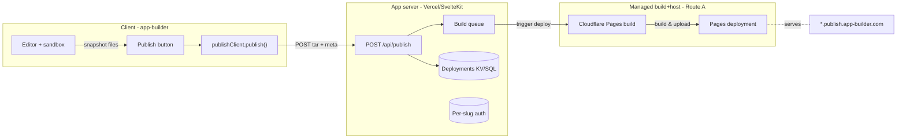

# TRL-161 — Spec: publish & deploy per-user subdomains

**Parent:** TRL-157 (multi-project dashboard) · **Proposal:** TRL-160
**Parent docs:** [`app_builder_multi_project_design.md`](../../artifacts/app_builder_multi_project_design.md)

## Problem

App-builder is a creator surface; creators want to **ship** what they make.
Today the only way to share a project is to send a Dexie snapshot or a `.sandboxes/` tarball.
There is no public URL, no immutable preview, no deploy history, and no custom-domain path.

Goal: **one click → `{slug}.publish.app-builder.com`** for any project, with a clear upgrade path to self-host and custom domains.

## Why this is tractable

The hosted artifact is **static**. The risky step is the build, and only the build.
A `vite build` for a Svelte/Vue/Vite+React project emits a directory of JS/CSS/HTML/assets.
Once the artifact exists, request-time hosting is cheap, safe, and horizontally scalable.
The only cost the system has to defend against is **arbitrary `pnpm install` + `vite build`** at deploy time.

This cleanly decouples:

```
[Publish]
  → 1. snapshot project files            (you have this: dexieProjectStore + .sandboxes)
  → 2. sandboxed build → ./dist           (← the only risk-bearing step)
  → 3. upload ./dist keyed by tenant slug (cheap, safe, static)
  → 4. wildcard DNS + wildcard TLS
  → https://{slug}.publish.app-builder.com
```

The split is the whole architecture. Hosting and build are not the same service.

## Approach: managed-build v1, self-host v2 (Route A → Route B)

### Route A — managed build + managed host (v1, recommended)

Pick **one** provider from {Cloudflare Pages, Vercel, Netlify} as the deploy target.
Why this is the right starting point:

- They run the build sandbox for you (gVisor / Firecracker / proprietary — you don't care).
- They hand you per-project subdomains for free (`{project}.{provider}.app`).
- They expose a single deploy API: POST a directory → get a URL.
- Cost at hobby scale is effectively zero.
- The diff between Cloudflare Pages and Vercel is mostly irrelevant at our scale; pick whichever the team is comfortable with. _Default recommendation: **Cloudflare Pages** — R2 object storage + Pages Functions means we can fold steps 3+4 onto the same vendor when we migrate to self-host later._

**Subdomain shape (v1):** `{slug}.publish.app-builder.com`

- Wildcard CNAME from `*.publish.app-builder.com` → provider
- Wildcard TLS cert issued by the provider
- Provider rewrites `{slug}` into a header (`x-publish-slug`) and serves the matching deployment
- For v1 we don't need our own wildcard cert or our own LB

### Route B — self-host on our infra (v2, cost optimization)

**When to switch:** when Route A cost or per-deploy latency becomes a problem, OR when we need a subdomain on a domain we own (`{slug}.app-builder.com`) without the provider suffix.

Components:

- **DNS:** `*.app-builder.com` CNAME → our edge LB (Fly / Caddy + a small VM / Cloudflare for SaaS)
- **TLS:** wildcard `*.app-builder.com` via Let's Encrypt DNS-01 (or Cloudflare for SaaS which automates this)
- **Storage:** one bucket per provider object store (R2 / S3) keyed by `tenants/{slug}/revisions/{revId}/`
- **Routing:** edge function reads `Host` header, looks up `{slug}.json` in KV, 302s to the immutable revision URL or streams from the bucket
- **Build sandbox:** this is the part that actually costs engineering hours in self-host. Pick one:
  - **Lightest:** worker queue + Docker-in-Docker with seccomp/namespace isolation. Acceptable for trusted-user build (your own app) but not great for arbitrary user code.
  - **Better:** Firecracker microVM per build (≈150ms boot), ephemeral, no network egress. This is the right answer if Route A doesn't pan out.
  - **Cheapest:** shell out to GitHub Actions / a serverless build runner per deploy. We pay per build minute and never own the sandbox.

**Migration A→B is cheap** because the hosted artifact is just files. The only thing that has to change is _where_ the build runs and _where_ `dist/` lands. DNS stays wildcard.

## Architecture



The app server is a thin orchestrator (create slug, enqueue, persist revision metadata). It does **not** run the build and does **not** serve the published site.

## Module layout (normative)

```
src/lib/publish/
  types.ts                  # Slug, DeployRequest, Deployment, BuildStatus
  slug.ts                   # normalize, reserved, collision
  publishClient.ts          # client wrapper: publish(), listDeployments(), getStatus()
  publishStatus.svelte.ts   # reactive status store per project

src/routes/api/publish/
  +server.ts                # POST /api/publish         (orchestrator)
  status/[deploymentId]/+server.ts  # GET status (SSE optional)
  list/[projectId]/+server.ts       # GET deployments

src/lib/components/
  publish-button.svelte     # In editor toolbar; states: idle | building | live | failed
  publish-dialog.svelte     # Slug input + URL preview + Deploy history list
  deploy-history.svelte     # List of past deployments w/ link + status

e2e/publish.spec.ts         # e2e for publish flow
docs/issues/TRL-161/        # summary.md, journal.md
```

## Data model (normative)

```ts
type Slug = string & { __brand: 'Slug' } // [a-z0-9-]{3,32}, no leading/trailing dash

type DeployStatus = 'queued' | 'building' | 'live' | 'failed' | 'canceled'

type Deployment = {
  id: string // ulid
  projectId: string // FK → ProjectRecord
  slug: Slug // chosen by user, defaults from project.name
  status: DeployStatus
  url: string // https://{slug}.publish.app-builder.com
  providerDeploymentId?: string // CF Pages deployment id
  buildLogUrl?: string
  createdAt: number
  updatedAt: number
  finishedAt?: number
  errorMessage?: string
}
```

### Slug rules (normative)

- Lowercase ASCII, `[a-z0-9-]`, length 3–32
- Cannot start or end with `-`
- Reserved: `www`, `api`, `admin`, `app`, `dashboard`, `editor`, `publish`, `status`, `static`, `assets`, `cdn`, `auth`, `login`, `logout`, `signup`, `help`, `support`, `docs`, `blog`, `mail`, `email`, `root`, `system`, `internal`, plus the top ~1000 of `disposable-email-domains` reversed (no `tempmail`, `mailinator`, etc.)
- Collision: append `-2`, `-3`, ... until unique (per `Deployment.slug`)
- **Project → slug default:** `slugify(project.name)` with the above constraints; user can override

### App server storage

For v1, deployments live in the same Postgres / KV / KV-equivalent the rest of the app uses (TBD per host; if SvelteKit+adapter-vercel, Vercel KV or Postgres). Key shape:

- `deployments:by-project:{projectId}` → list of `Deployment` (most recent first)
- `deployments:by-slug:{slug}` → current `Deployment` for a slug (latest `live` wins)
- `deployments:detail:{deploymentId}` → full record

## Publish flow (normative)

### Client

1. User clicks **Publish** in editor toolbar.
2. `publish-dialog.svelte` opens, pre-fills slug from project name, validates in real time, shows URL preview.
3. User confirms → `publishClient.publish({ projectId, slug })`:
   - Snapshots current `WebContainer` (or `.sandboxes/{id}`) into a tarball in-memory.
   - `POST /api/publish` with `multipart/form-data` (tar + meta).
   - Subscribes to `/api/publish/status/{id}` (SSE; poll fallback).
4. UI states: `queued → building → live` (or `failed` with `errorMessage` + build log link).

### Server (`POST /api/publish`)

1. Auth: require authenticated user who owns `projectId`.
2. Validate slug: format, reserved list, current-tenant-uniqueness.
3. Create `Deployment` record (`status: 'queued'`).
4. Build a deployable project from the snapshot:
   - Inject a tiny `app-builder.config.json` (`{ buildCommand, outputDir, framework }`) — defaults: `vite build`, `dist`, `svelte` (resolved from template).
   - Re-emit as a tarball or push to the provider's expected source.
5. Trigger provider build (one API call). Provider returns a deployment id; persist as `providerDeploymentId`, set `status: 'building'`.
6. Return `{ deploymentId, url }` to client. The URL is `{slug}.publish.app-builder.com` and is **live-as-soon-as-build-succeeds**.

### Webhook / status sync

The provider's deploy webhook (`POST /api/publish/webhook`) flips `status` to `live` or `failed` and writes the build log URL. The webhook is HMAC-signed; verify with a shared secret.

## Editor toolbar integration (normative)

Add a new **Publish** button to the editor toolbar (right side, near the project name).
States:

| State      | Look                         | Behavior                                                  |
| ---------- | ---------------------------- | --------------------------------------------------------- |
| `idle`     | Outline button, "Publish"    | Opens `publish-dialog.svelte`                             |
| `building` | Spinner + "Building {slug}…" | Disabled; live status from server                         |
| `live`     | Solid primary + "Live ↗"    | Opens `https://{slug}.publish.app-builder.com` in new tab |
| `failed`   | Destructive + "Failed"       | Click → reopens dialog w/ error + build log               |

The button MUST reflect state derived from `publishStatus.svelte.ts`, not from local component state. State is keyed by `projectId` so switching projects in the dashboard doesn't cross-contaminate.

## Security (normative)

- **Auth on every `/api/publish/*` route.** No anonymous publishing. Session via existing app auth.
- **Tenant isolation:** `slug` is unique across all users. No user can claim/overwrite another user's slug.
- **Subdomain takeover prevention:** when a deployment is deleted or moved, return **410 Gone** (or 404) for the old slug, never serve someone else's content.
- **Content scanning (post-v1):** scan built `dist/` for common patterns (crypto miners, credential exfil URLs). Cheap regex pass; not security-grade but catches the obvious.
- **CSP header** on hosted sites: a reasonable default CSP injected by the provider or by our edge function.
- **Rate limit** the publish endpoint per user (e.g. 10 deploys / hour) to bound build cost and abuse.
- **Build sandbox** is the provider's responsibility in v1 (Route A). When we move to Route B, document the isolation model in `docs/security/publish-sandbox.md` and require a security review.

## Out of scope (v1)

- Custom domains (`yourdomain.com` → your slug)
- Password-protected deployments
- Per-revision preview URLs (e.g. `{slug}-{rev}.publish.app-builder.com`) — defer to v1.5
- Branch / git-backed deploys
- Concurrent multi-revision deploys per project
- CDN-level cache invalidation beyond provider defaults
- Self-host (Route B) — design only, do not build

## Acceptance criteria

```text
test:pnpm run check
test:test -f docs/issues/TRL-161/summary.md
test:grep -q "publish/" src/lib/publish/types.ts
test:grep -q reserved src/lib/publish/slug.ts
test:grep -q publish src/routes/api/publish/+server.ts
test:grep -q publish-button src/lib/components/publish-button.svelte
test:grep -q publish-dialog src/lib/components/publish-dialog.svelte
test:grep -q 'publish.app-builder.com' src/lib/publish/types.ts
test:grep -q providerDeploymentId src/lib/publish/types.ts
test:grep -q HMAC src/routes/api/publish/webhook/+server.ts
test:grep -q Slug src/lib/publish/types.ts
test:test -f e2e/publish.spec.ts
test:PUBLIC_SANDBOX_BACKEND=webcontainer pnpm test:e2e e2e/publish.spec.ts --workers=1
```

### e2e scenarios (`e2e/publish.spec.ts`)

1. Editor toolbar shows Publish button (idle state) for a fresh project
2. Clicking Publish opens dialog with slug pre-filled and URL preview visible
3. Reserved slugs (`admin`, `api`) are rejected client-side
4. Collision: a second publish with the same slug auto-suffixes `-2`
5. Mocked `POST /api/publish` returns `queued`; button transitions to `building`
6. Mocked webhook flips to `live`; button shows "Live ↗" with the right URL
7. Switching projects clears the publish-status state for the previous project

## File touch list

**New:**

- `src/lib/publish/{types,slug,publishClient,publishStatus.svelte}.ts`
- `src/routes/api/publish/+server.ts`
- `src/routes/api/publish/status/[deploymentId]/+server.ts`
- `src/routes/api/publish/list/[projectId]/+server.ts`
- `src/routes/api/publish/webhook/+server.ts`
- `src/lib/components/{publish-button,publish-dialog,deploy-history}.svelte`
- `e2e/publish.spec.ts`
- `docs/issues/TRL-161/{summary,journal}.md`
- `docs/security/publish-sandbox.md` (stub, filled in if/when Route B)

**Modify:**

- `src/lib/components/editor-toolbar.svelte` (or wherever the toolbar lives) — add Publish button
- `src/lib/projects/dexieProjectStore.ts` — add `slug?: Slug` to `ProjectRecord` (optional override; defaults from `name`)

## Open questions for Strategist

1. Provider choice: **Cloudflare Pages** (recommended) vs **Vercel** vs **Netlify**? Default CF unless the user objects.
2. Default domain: `publish.app-builder.com` or `live.app-builder.com`? My pick: `publish` (matches the verb).
3. Slug auto-suffix on collision vs require user to pick a new slug? My pick: auto-suffix `-2`, then `-3`, etc., up to 5 attempts; after that require manual.
4. Free vs paid? My pick: free in v1, rate-limited; revisit when we have paying users.
5. Custom domains in v1.5 or v2? My pick: v2, after Route A→B decision is made.
